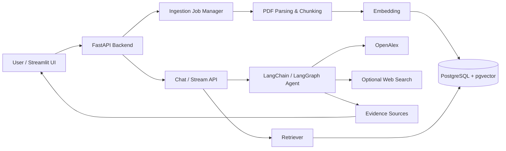

# 科研论文阅读助手（Agentic RAG）

一个面向科研论文阅读、分析与文献对比的 **Agentic RAG** 系统。用户可以通过前端上传 PDF，系统自动完成文档解析、分块、向量化入库，并基于本地知识库、OpenAlex 学术检索与可选通用网页搜索，提供可追溯的论文问答与分析能力。

适合用于：

- 快速总结论文的研究问题、核心方法与创新点
- 拆解方法流程、实验设置、评价指标与局限性
- 对比多篇论文的研究问题、方法差异与适用场景
- 补充 related work、作者、年份、DOI 与来源链接
- 构建本地/私有化科研论文知识库问答系统

---

## ✨ 功能特性

| 模块 | 能力 |
|---|---|
| 文档入库 | 前端上传 PDF、后台入库任务、进度条、取消任务 |
| RAG 检索 | 支持 `vector` / `hybrid` 检索，基于 PostgreSQL + pgvector |
| Agent 工具 | 本地知识库检索、文档读取、OpenAlex 学术检索、通用 Web Search |
| 深度分析 | 使用 LangGraph 编排文档检查、检索、生成与证据检查流程 |
| 会话系统 | 支持 session 持久化、历史会话恢复、长对话摘要压缩 |
| 前端体验 | Streamlit 聊天界面、论文分析面板、SSE 流式输出、停止生成 |
| 证据追踪 | 本地知识库来源与网页来源结构化回传，并在前端分组展示 |

---

## 🧱 技术栈

- Python 3.11+
- FastAPI
- Streamlit
- LangChain
- LangGraph
- PostgreSQL / pgvector
- Docling
- OpenAI-compatible LLM / Embedding API
- Docker Compose

---

## 🏗️ 系统架构



---

## 🚀 快速开始

### 1. 克隆项目

```bash
git clone <your-repo-url>
cd agentic_rag_project-main2
```

### 2. 准备环境变量

Linux / macOS：

```bash
cp .env.example .env
```

Windows PowerShell：

```powershell
copy .env.example .env
```

然后编辑 `.env`，至少配置 OpenAI-compatible 模型服务：

```env
OPENAI_API_KEY=your_api_key
OPENAI_BASE_URL=https://your-openai-compatible-endpoint/v1
LLM_CHOICE=gpt-4o-mini
EMBEDDING_MODEL=text-embedding-3-small
```

### 3. 启动服务

```bash
docker compose up -d
```

常用访问地址：

- UI: `http://localhost:8502`
- API: `http://localhost:8059`
- API Docs: `http://localhost:8059/docs`

### 4. 健康检查

```bash
curl http://localhost:8059/health/live
```

Windows PowerShell 推荐使用：

```powershell
curl.exe http://localhost:8059/health/live
```

---

## ⚙️ 环境变量

### 必填：LLM / Embedding

```env
OPENAI_API_KEY=your_api_key
OPENAI_BASE_URL=https://your-openai-compatible-endpoint/v1
LLM_CHOICE=gpt-4o-mini
EMBEDDING_MODEL=text-embedding-3-small
```

### 数据库

```env
DB_HOST=postgres
DB_PORT=5432
DB_USER=postgres
DB_PASSWORD=postgres
DB_NAME=agentic_rag
```

### 可选：OpenAlex 学术检索

```env
OPENALEX_API_KEY=your_openalex_key
OPENALEX_MAILTO=
```

未配置 `OPENALEX_API_KEY` 时，本地知识库问答仍可正常使用。

### 可选：通用网页搜索

```env
GENERAL_WEB_SEARCH_ENABLED=false
GENERAL_WEB_SEARCH_PROVIDER=bocha
GENERAL_WEB_SEARCH_API_KEY=your_bocha_api_key
GENERAL_WEB_SEARCH_ENDPOINT=https://api.bochaai.com/v1/web-search
```

说明：

- 通用网页搜索默认关闭，避免依赖付费 API 额度。
- 配置有效 provider、API key 与可用额度后，可用于普通网页资料、技术解释与最新信息补充。
- `.env` 仅用于本地运行，不应提交到 GitHub。

---

## 📄 文档入库

### 前端上传入库（推荐）

1. 打开前端：`http://localhost:8502`
2. 点击聊天输入框上方的 `📄 分析面板`
3. 在“上传论文入库”中选择 PDF
4. 点击“开始入库”
5. 页面会显示后台任务进度条
6. 如需中止，可点击“取消入库”
7. 入库成功后，新论文会出现在分析面板的论文选择列表中

说明：

- 前端入库会创建后台任务，不需要手动进入容器执行命令。
- 进度条为 **best-effort**，基于后端阶段和日志解析估算，不代表精确页级或 token 级进度。
- 任务状态保存在 API 进程内存中，API 重启后进行中的任务状态会丢失。
- 上传大小由 `DOCUMENT_UPLOAD_MAX_BYTES` 控制，默认 30MB。

### 命令行批量入库

批量导入多篇论文时，可以使用命令行方式：

```bash
docker compose exec api python -m ingestion.ingest --documents documents --fast -v
```

如果需要更完整的图片、表格或语义解析，可根据 ingestion 参数关闭快速模式。

---

## 💬 前端使用

### 侧栏

- 配置 API 地址
- 检查服务状态
- 新建对话
- 刷新会话列表
- 清空当前对话
- 恢复历史会话

### 输入框上方工具栏

- `📄 分析面板`：上传论文、选择论文、单篇分析、多篇对比
- `🛠 工具`：切换 OpenAlex、通用网页搜索、深度分析与检索方式
- `■ 停止`：流式输出时停止继续接收，保留当前已生成内容

### 证据展示

回答下方会显示“依据片段”，并按来源分组：

- 本地知识库
- 联网搜索 / OpenAlex 来源

---

## 🔍 深度分析模式

深度分析模式不是简单拉长 prompt，而是使用 LangGraph 将论文分析拆成可控流程：

1. 检查知识库文档
2. 本地检索相关片段
3. 生成分析草稿
4. 进行轻量证据检查
5. 整理最终回答

该模式适合：

- 论文总结
- 方法流程拆解
- 实验解读
- 创新点分析
- 局限性分析
- 多篇论文对比

如果证据不足，系统会尽量明确说明不确定性，避免无依据扩展。

---

## 🔌 API 概览

| 接口 | 说明 |
|---|---|
| `GET /health/live` | 存活检查 |
| `GET /health` | 数据库与模型连接健康检查 |
| `POST /chat` | 普通问答 |
| `POST /chat/stream` | SSE 流式问答 |
| `GET /documents` | 文档列表 |
| `POST /documents/upload` | 同步 PDF 入库接口（兼容保留） |
| `POST /documents/upload/start` | 创建异步 PDF 入库任务 |
| `GET /documents/upload/jobs/{job_id}` | 查询入库任务状态 |
| `POST /documents/upload/jobs/{job_id}/cancel` | 取消入库任务 |
| `GET /sessions` | 会话列表 |
| `GET /sessions/{session_id}/messages` | 会话消息 |
| `GET /openalex/status` | OpenAlex 可用状态 |
| `POST /openalex/add-to-kb` | 将 OpenAlex 来源加入知识库 |
| `GET /web-search/status` | 通用网页搜索状态 |

---

## 📁 项目结构

```text
agent/                 Agent、API、工具调用、会话与入库任务
ingestion/             PDF 解析、分块、embedding、入库
ui/                    Streamlit 前端
common/                前后端共享展示工具
sql/                   PostgreSQL / pgvector 初始化脚本
tests/                 单元测试
dev_checks/            开发阶段检查脚本
documents/             本地文档目录（默认不提交真实 PDF）
docker-compose.yml     容器编排
```

---

## 🧪 开发检查

基础语法检查：

```bash
python -m py_compile agent/*.py ui/*.py common/*.py ingestion/*.py
```

运行测试：

```bash
pytest
```

部分集成测试可能依赖 `.env` 中的数据库、模型服务或外部检索配置。

---

## ⚠️ 安全与限制

- 不要提交 `.env`、真实 API key 或数据库密码。
- 不建议将 `documents/` 下的真实论文 PDF 提交到公开仓库。
- 通用网页搜索依赖第三方 provider 和 API 额度，默认关闭。
- PDF 入库进度为阶段估算，不是精确页级/token 级进度。
- 入库任务状态保存在 API 进程内存中，API 重启后进行中的任务状态会丢失。
- 跨领域效果依赖文档解析质量、知识库质量和检索命中率。
- 当前项目更适合本地或私有化部署，不建议在无鉴权情况下直接公网开放。

---

## 🗺️ 后续规划

- 拆分后端 API，将 chat、documents、sessions、health 等路由迁移到 routes/services 模块
- 增加检索评测集，对比 vector 与 hybrid 检索效果
- 增强来源定位粒度，例如页码、章节、段落
- 支持更稳定的任务队列，例如 Redis/Celery
- 可选增加用户认证与多用户数据隔离

## 致谢

本项目的初始项目结构参考了开源项目 [serkanyasr/agentic_rag_project](https://github.com/serkanyasr/agentic_rag_project)，该项目基于 MIT License 发布。

在此基础上，本项目已围绕科研论文阅读场景进行了较大幅度的重构与扩展，包括 LangChain / LangGraph Agent 工作流、会话历史与长对话摘要压缩、OpenAlex 学术检索、可选通用网页搜索、前端 PDF 上传入库、入库进度与取消任务、证据来源展示等功能。

原项目的 MIT License 与版权声明已保留。
---

## License

MIT License

