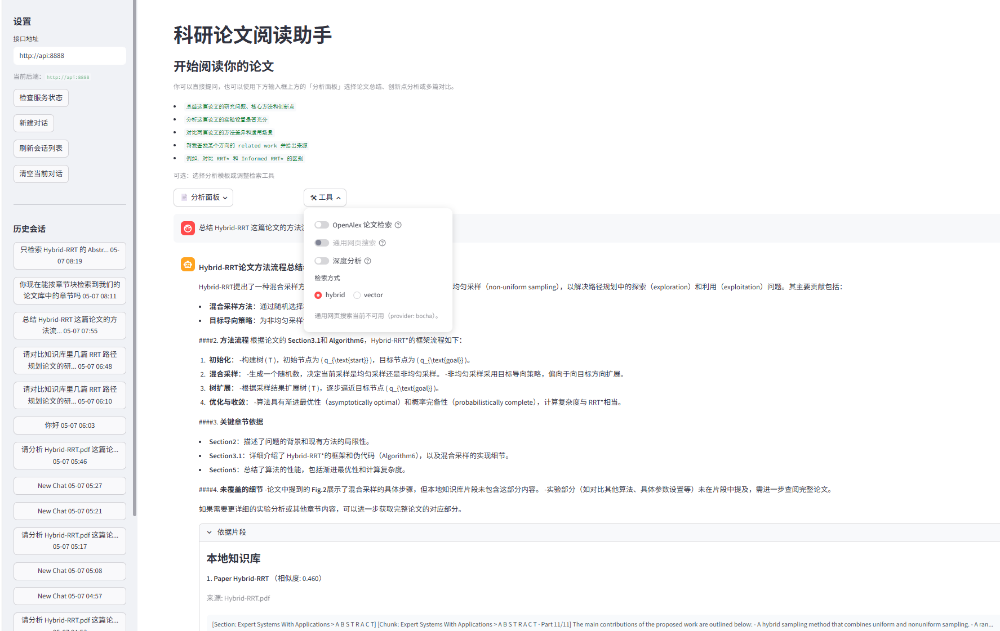
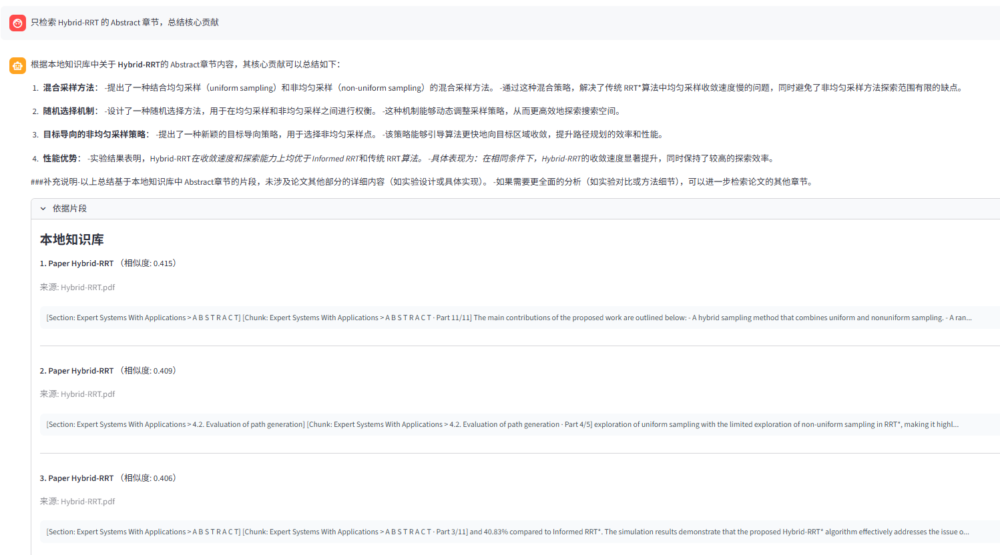
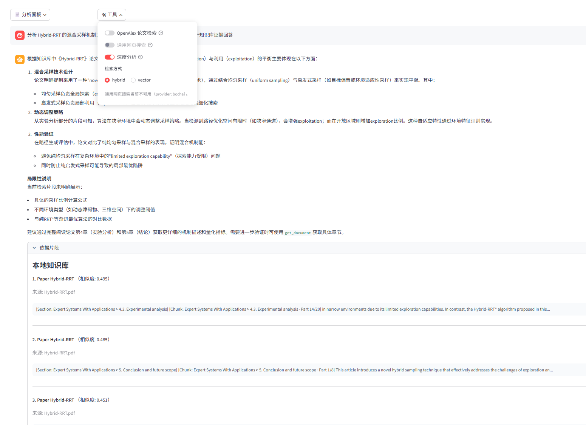
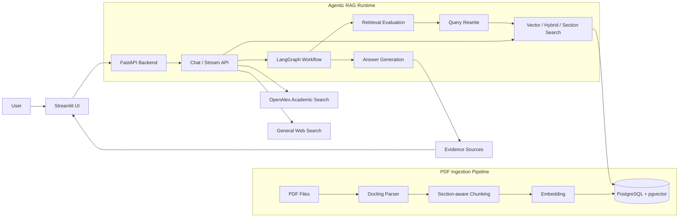
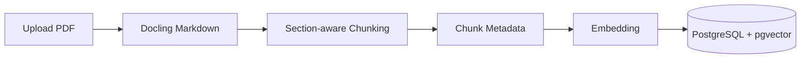
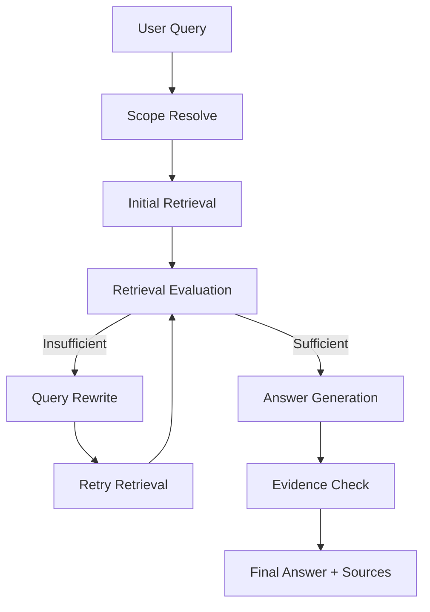
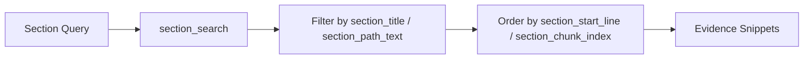
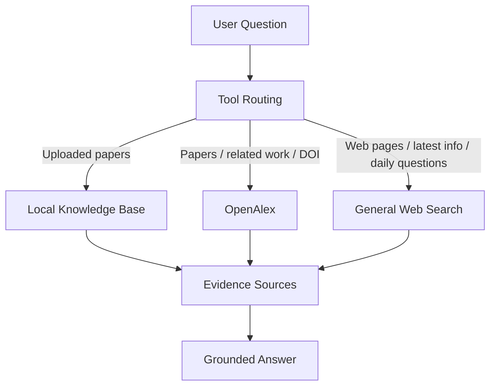
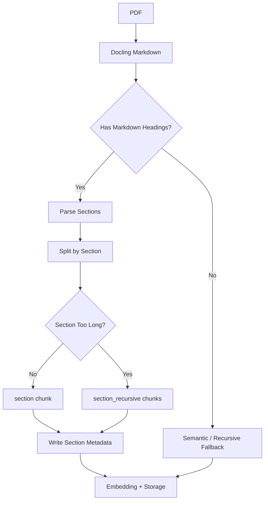

<div align="center">

# 📚 Agentic RAG Paper Assistant

**集论文知识库、学术检索、通用网页搜索与证据追踪于一体的 Agentic RAG 系统**

基于 **FastAPI + Streamlit + PostgreSQL/pgvector + LangChain/LangGraph** 构建，支持 PDF 论文入库、结构化切块、章节级检索、OpenAlex 学术检索、通用网页搜索、流式问答与可追溯证据展示。

<br />


<br />

[项目简介](#-项目简介) ·
[界面预览](#️-界面预览) ·
[功能亮点](#-功能亮点) ·
[系统架构](#️-系统架构) ·
[评测结果](#-评测与效果验证) ·
[快速开始](#-快速开始) ·
[使用示例](#-使用示例) ·
[API](#-api-概览)

</div>

---

## 📌 项目简介

**Agentic RAG Paper Assistant** 是一个以科研论文阅读为核心、同时支持开放域网页检索的 Agentic RAG 系统。用户可以上传 PDF 论文，系统自动完成 Docling 解析、章节感知切块、embedding 入库，并通过 Agent 工具完成论文总结、方法拆解、实验解读、创新点分析和多篇论文对比。

系统同时支持三类外部/内部知识来源：

| 来源 | 作用 |
|---|---|
| 本地论文知识库 | 基于用户上传 PDF 的全文证据回答论文问题 |
| OpenAlex 学术检索 | 查询知识库外论文、related work、作者、年份、DOI 和开放获取链接 |
| 通用 Web Search | 查询普通网页资料、技术解释、最新信息和非论文来源 |
| 模型通用知识 | 用于补充解释，但不伪装成本地论文证据 |

相比普通“向量检索 + LLM 总结”的 RAG Demo，本项目重点实现了：

- **Agentic RAG 工作流**：基于 LangGraph 实现检索评估、query rewrite、retry retrieval 和证据检查。
- **Section-aware Chunking**：按论文 Markdown 标题结构识别章节，记录章节路径、行号和章节内分片序号。
- **Section-level Retrieval**：支持基于 `section_title / section_path_text` 的章节级过滤检索。
- **多来源证据追踪**：区分本地论文证据、OpenAlex 学术元数据、网页来源和模型通用知识。
- **轻量评测闭环**：提供普通检索、章节检索 A/B、多轮检索闭环三类评测脚本。

> 当前项目适合本地或私有化部署，用于展示 Agentic RAG、论文结构化检索、开放域检索接入和工程化评测能力；不是生产级多用户 SaaS 平台。

---

## 🖼️ 界面预览

将实测截图放入 `docs/assets/` 后，GitHub 会自动渲染。

| 聊天问答 | 论文分析面板 | 章节级证据 |
|---|---|---|
|  |  |  |
| 流式回答、历史会话、工具开关 | 上传论文、单篇分析、多篇对比 | 显示 Section、行号与分片序号 |

| 深度分析 | OpenAlex 学术检索 |
|---|---|
|  |  |
| LangGraph 多轮检索与复杂问题分析 | related work、作者、年份、DOI 与来源链接 |
---

## ✨ 功能亮点

<table>
  <tr>
    <td width="50%">
      <h3>📄 PDF 论文入库</h3>
      <p>前端上传 PDF，后端异步解析、切块、embedding 入库，并支持进度展示和取消任务。</p>
    </td>
    <td width="50%">
      <h3>🧩 Section-aware Chunking</h3>
      <p>基于 Docling 输出的 Markdown 标题识别论文结构；长章节继续递归切块，保留章节标题、章节路径、行号和分片序号。</p>
    </td>
  </tr>
  <tr>
    <td width="50%">
      <h3>🔎 向量 / 混合检索</h3>
      <p>基于 PostgreSQL + pgvector 构建本地知识库检索，支持 vector search 与 hybrid search。</p>
    </td>
    <td width="50%">
      <h3>🎯 章节级精准检索</h3>
      <p>新增 <code>section_search</code> 工具，可按 <code>section_title</code> 或 <code>section_path_text</code> 过滤目标章节，并按原文顺序返回。</p>
    </td>
  </tr>
  <tr>
    <td width="50%">
      <h3>🧠 LangGraph 多轮检索闭环</h3>
      <p>检索不足时自动评估覆盖度、生成改写 query 并重试检索，提升复杂论文问题的召回稳定性。</p>
    </td>
    <td width="50%">
      <h3>🔬 OpenAlex 学术检索</h3>
      <p>用于查找知识库外论文、related work、作者、年份、DOI 和开放获取链接，可辅助扩展本地论文库。</p>
    </td>
  </tr>
  <tr>
    <td width="50%">
      <h3>🌐 通用网页搜索</h3>
      <p>配置 Web Search provider 后，可回答普通网页资料、技术解释、最新信息和非论文来源问题，并区分网页来源与本地论文证据。</p>
    </td>
    <td width="50%">
      <h3>📍 证据来源追踪</h3>
      <p>回答下方展示本地知识库、OpenAlex 或网页来源片段，并尽量标注文档、章节、行号和分片序号。</p>
    </td>
  </tr>
</table>

---

## 🏗️ 系统架构



---

## 🔁 核心工作流

### 1. PDF 入库流程



### 2. Agentic RAG 问答流程



### 3. 章节级检索流程



### 4. 外部检索来源边界



---

## 🧩 Section-aware Chunking

本项目针对论文 PDF 的结构特点，对普通 chunking 做了增强：



每个章节感知 chunk 会保存类似 metadata：

```json
{
  "section_title": "3.1. Proposed hybrid-RRT* framework",
  "section_path_text": "Expert Systems With Applications > 3.1. Proposed hybrid-RRT* framework",
  "section_start_line": 120,
  "section_end_line": 180,
  "section_chunk_index": 1,
  "section_chunk_count": 4,
  "chunk_method": "section_recursive"
}
```

同时，chunk content 会写入章节上下文前缀，让 embedding 和文本检索都能感知章节语义：

```text
[Section: Method > Hybrid Sampling]
[Chunk: Method > Hybrid Sampling · Part 2/4]

The pseudo-code for the proposed Hybrid-RRT* framework is presented in Algorithm 6...
```

---

## 🧪 评测与效果验证

本项目补充了轻量评测集，用于验证普通检索、章节级检索和 LangGraph 多轮检索闭环。评测集不是大规模 benchmark，但能验证核心链路是否有效。

### A. Retrieval Eval（limit=5）

| Metric | Value |
|---|---:|
| Total Cases | 15 |
| Doc Hit@1 | 0.73 |
| Doc Hit@5 | 1.00 |
| Section Hit@5 | 0.73 |
| Avg Keyword Recall@5 | 0.78 |

**解读**：普通 hybrid 检索能稳定命中目标论文，Top-5 文档命中率达到 1.00，适合开放式论文问答。

### B. Section Eval A/B（limit=5）

| Metric | Section Search | Hybrid Search |
|---|---:|---:|
| Section Precision@5 | 0.60 | 0.42 |
| Doc Hit@5 | 0.60 | 1.00 |
| Keyword Recall@5 | 0.47 | 0.83 |
| Order OK Rate | 1.00 | 0.00 |

**解读**：`section_search` 在目标章节命中率和原文顺序保持上更有优势，适合“只看 Abstract / Experiments / References”等章节级问题；`hybrid_search` 在全局关键词覆盖和目标论文命中方面更强，适合开放式全局问答。

### C. Retrieval Loop Eval（max_cases=5）

| Metric | Value |
|---|---:|
| Total Cases | 5 |
| Doc Hit@K | 1.00 |
| Avg Keyword Recall@K | 0.44 |
| Rewrite Used Rate | 0.60 |
| Avg Retrieval Attempts | 1.60 |
| Avg Retrieval Confidence | 0.64 |

**解读**：LangGraph 检索闭环能够触发 query rewrite；5 个挑战问题中 60% 使用了 rewrite，平均检索轮数为 1.60。

运行命令：

```bash
docker compose exec api python evals/run_retrieval_eval.py --limit 5
docker compose exec api python evals/run_section_eval.py --limit 5
docker compose exec api python evals/run_retrieval_loop_eval.py --max-cases 5 --timeout-seconds 120 --verbose
```

结果文件：

```text
evals/results/retrieval_eval.md
evals/results/section_eval.md
evals/results/retrieval_loop_eval.md
```

---

## 🧱 技术栈

| 层级 | 技术 |
|---|---|
| 前端 | Streamlit |
| 后端 | FastAPI, SSE |
| Agent | LangChain, LangGraph, Pydantic AI |
| 检索 | vector search, hybrid search, section_search |
| 数据库 | PostgreSQL, pgvector |
| PDF 解析 | Docling |
| 模型接口 | OpenAI-compatible LLM / Embedding API |
| 外部检索 | OpenAlex, General Web Search |
| 部署 | Docker Compose |

---

## 🚀 快速开始

### 1. 克隆项目

```bash
git clone https://github.com/zebir-sir/agentic-rag-paper-assistant.git
cd agentic-rag-paper-assistant
```

### 2. 准备环境变量

Linux / macOS：

```bash
cp .env.example .env
```

Windows PowerShell：

```powershell
copy .env.example .env
```

至少配置 OpenAI-compatible 模型服务：

```env
OPENAI_API_KEY=your_api_key
OPENAI_BASE_URL=https://your-openai-compatible-endpoint/v1
LLM_CHOICE=gpt-4o-mini
EMBEDDING_MODEL=text-embedding-3-small
```

### 3. 启动服务

```bash
docker compose up -d
```

默认访问地址：

| 服务 | 地址 |
|---|---|
| Streamlit UI | `http://localhost:8502` |
| FastAPI Backend | `http://localhost:8059` |
| API Docs | `http://localhost:8059/docs` |

### 4. 健康检查

```bash
curl http://localhost:8059/health/live
```

Windows PowerShell：

```powershell
curl.exe http://localhost:8059/health/live
```

---

## ⚙️ 环境变量

### LLM / Embedding

```env
OPENAI_API_KEY=your_api_key
OPENAI_BASE_URL=https://your-openai-compatible-endpoint/v1
LLM_CHOICE=gpt-4o-mini
EMBEDDING_MODEL=text-embedding-3-small
```

### PostgreSQL

```env
DB_HOST=postgres
DB_PORT=5432
DB_USER=postgres
DB_PASSWORD=postgres
DB_NAME=agentic_rag
```

### OpenAlex 学术检索（可选）

```env
OPENALEX_API_KEY=your_openalex_key
OPENALEX_MAILTO=
```

未配置 `OPENALEX_API_KEY` 时，本地知识库问答仍可正常使用。

### 通用网页搜索（可选）

```env
GENERAL_WEB_SEARCH_ENABLED=false
GENERAL_WEB_SEARCH_PROVIDER=bocha
GENERAL_WEB_SEARCH_API_KEY=your_api_key
GENERAL_WEB_SEARCH_ENDPOINT=https://api.bochaai.com/v1/web-search
```

通用网页搜索默认关闭。配置 provider、endpoint 和 API key 后，可用于普通网页资料、技术解释、最新信息和非论文来源问题回答。

> `.env` 只用于本地运行，不应提交到 GitHub。

---

## 📄 文档入库

### 前端上传入库

1. 打开 `http://localhost:8502`
2. 点击聊天输入框上方的 `📄 分析面板`
3. 选择 PDF 文件
4. 点击“开始入库”
5. 等待进度条完成
6. 入库成功后，可在论文选择列表中直接分析

### 命令行批量入库

快速模式：

```bash
docker compose exec api python -m ingestion.ingest --documents documents --fast --verbose
```

修改 chunking 逻辑后，可以重建论文库，只清理 `documents/chunks`，不删除会话和消息：

```bash
docker compose exec -e ALLOW_KB_RESET=true api python -m ingestion.ingest --documents documents --reset-kb --fast --verbose
```

完整模式会保留更多 Docling 解析能力，但耗时更长：

```bash
docker compose exec -e ALLOW_KB_RESET=true api python -m ingestion.ingest --documents documents --reset-kb --verbose
```

> 日常重建论文库请使用 `--reset-kb`，不要使用 `--clean`。`--clean` 会清理会话、消息、文档和 chunks。

---

## 💬 使用示例

### 论文知识库问答

```text
总结 Hybrid-RRT 这篇论文的方法流程，并说明依据来自哪些章节。
```

```text
只检索 Hybrid-RRT 的 Abstract 章节，总结核心贡献。
```

```text
对比 HA-RRT、HMA-RRT 和 Hybrid-RRT 的核心方法差异，优先基于知识库证据回答。
```

### 学术检索与 related work

```text
查找 USV 路径规划方向 related work，并给出作者、年份、DOI。
```

```text
帮我找几篇关于 RRT* 改进算法的开放获取论文，并说明来源。
```

### 通用网页搜索与技术解释

```text
联网查一下 RRT* 和 Informed RRT* 的区别，并给出网页来源。
```

```text
解释 APF-RRT* 是什么，和普通 RRT* 有什么关系？
```

```text
这个算法里的 exploration 和 exploitation 在采样规划中分别指什么？
```

---

## 🔌 API 概览

| 接口 | 说明 |
|---|---|
| `GET /health/live` | 存活检查 |
| `GET /health` | 数据库与模型连接健康检查 |
| `POST /chat` | 普通问答 |
| `POST /chat/stream` | SSE 流式问答 |
| `GET /documents` | 文档列表 |
| `POST /documents/upload` | 同步 PDF 入库接口 |
| `POST /documents/upload/start` | 创建异步 PDF 入库任务 |
| `GET /documents/upload/jobs/{job_id}` | 查询入库任务状态 |
| `POST /documents/upload/jobs/{job_id}/cancel` | 取消入库任务 |
| `GET /sessions` | 会话列表 |
| `GET /sessions/{session_id}/messages` | 会话消息 |
| `GET /openalex/status` | OpenAlex 可用状态 |
| `POST /openalex/add-to-kb` | 将 OpenAlex 论文来源加入知识库 |
| `GET /web-search/status` | 通用网页搜索状态 |

---

## 📁 项目结构

```text
agent/
  api.py                 FastAPI 路由、聊天执行、流式输出
  agent.py               Pydantic AI Agent 工具注册
  agent_langchain.py     LangChain Agent 执行与流式处理
  agent_langgraph.py     LangGraph 深度分析工作流
  db_utils.py            PostgreSQL / pgvector 数据访问
  tools.py               检索、OpenAlex、Web Search 工具
  tool_payloads.py       工具结果转 payload 与 evidence 收集
  routing.py             问题类型识别与输出格式约束

ingestion/
  extract_files.py       Docling PDF 解析
  chunker.py             Section-aware chunking
  ingest.py              embedding 与 PostgreSQL 入库

ui/
  app.py                 Streamlit 主界面
  api_client.py          后端 API 与 SSE 客户端
  components.py          来源展示、分析面板、UI 组件
  prompt_templates.py    论文分析模板

evals/
  run_retrieval_eval.py       普通检索评测
  run_section_eval.py         章节检索 A/B 评测
  run_retrieval_loop_eval.py  多轮检索闭环评测
  results/                    评测报告输出

common/                  前后端共享展示工具
sql/                     PostgreSQL / pgvector 初始化脚本
tests/                   测试文件
documents/               本地论文目录，默认不提交真实 PDF
```

---

## 🧪 开发检查

语法检查：

```bash
python -m py_compile agent/*.py ui/*.py common/*.py ingestion/*.py
python -m py_compile evals/run_retrieval_eval.py evals/run_section_eval.py evals/run_retrieval_loop_eval.py
```

运行测试：

```bash
pytest
```

运行评测：

```bash
docker compose exec api python evals/run_retrieval_eval.py --limit 5
docker compose exec api python evals/run_section_eval.py --limit 5
docker compose exec api python evals/run_retrieval_loop_eval.py --max-cases 5 --timeout-seconds 120 --verbose
```

> 部分集成测试和评测依赖 PostgreSQL、模型服务、embedding 配置或外部检索配置。

---

## ⚠️ 安全与限制

- 不要提交 `.env`、真实 API key 或数据库密码。
- 不建议将 `documents/` 下的真实论文 PDF 提交到公开仓库。
- 通用网页搜索依赖第三方 provider 和 API key，默认关闭。
- OpenAlex 主要提供论文元数据、摘要线索和开放获取链接，不等同于本地论文全文证据。
- Web Search 结果是网页来源证据，不应与本地论文原文证据混淆。
- 入库任务状态目前保存在 API 进程内存中，服务重启后进行中的任务状态会丢失。
- PDF 章节识别质量依赖 Docling 输出；复杂排版可能影响 section metadata。
- `section_search` 是基于 chunk metadata 的章节过滤检索，不等于完整文档结构解析系统。
- 当前项目适合本地或私有化部署，不建议在无鉴权情况下直接公网开放。

---

## 🗺️ 后续规划

- 页码级 evidence 定位
- 扩展更大的检索评测集和更多文档集验证
- 入库任务迁移到 Redis / Celery 等持久任务队列
- 后端 routes / services 模块拆分
- 用户认证与多用户数据隔离
- 更细粒度的章节树展示与文档结构恢复

---

## 🙏 致谢

本项目的初始项目结构参考了开源项目 [serkanyasr/agentic_rag_project](https://github.com/serkanyasr/agentic_rag_project)，该项目基于 MIT License 发布。

在此基础上，本项目围绕科研论文阅读和可追溯问答场景进行了重构与扩展，包括：

- LangChain / LangGraph Agent 工作流
- 会话历史与长对话摘要压缩
- OpenAlex 学术检索与可选通用网页搜索
- 前端 PDF 上传入库、进度展示与取消任务
- section-aware chunking 与章节级检索
- evidence source 展示与章节级证据追踪
- 轻量检索评测与章节检索 A/B 验证

原项目的 MIT License 与版权声明已保留。

---

## 📜 License

MIT License
