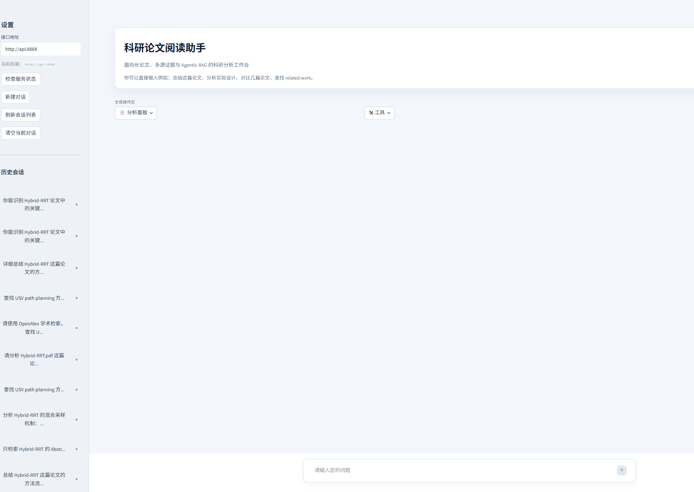
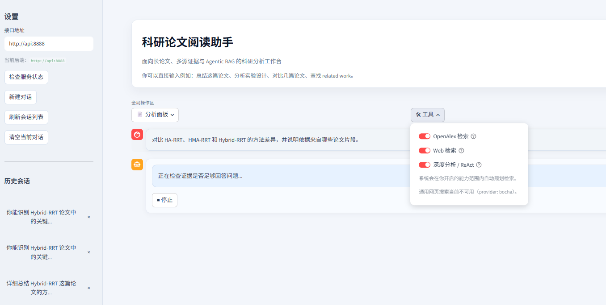
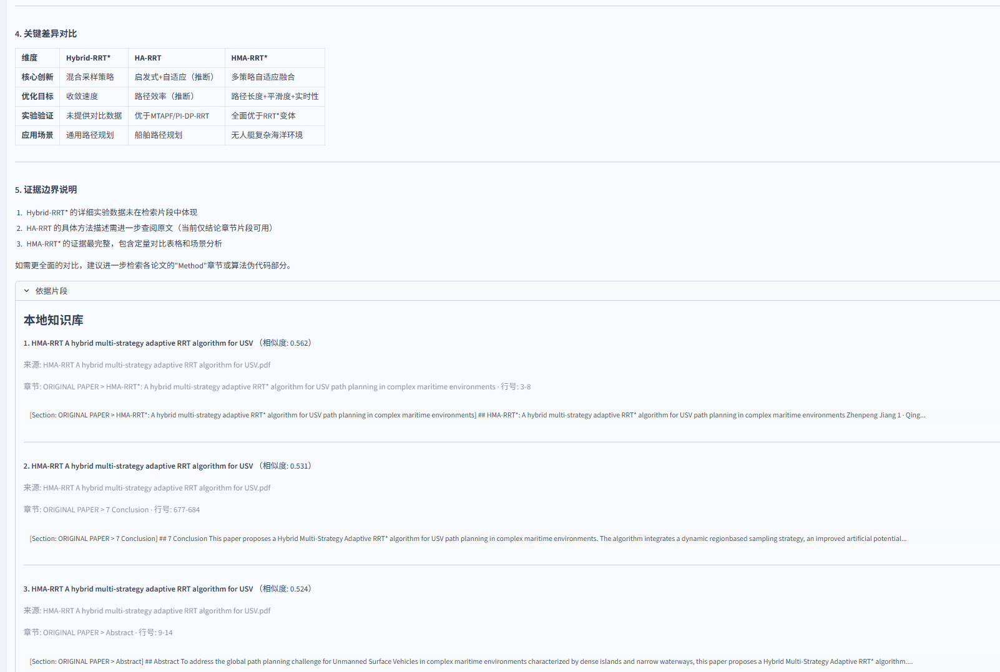
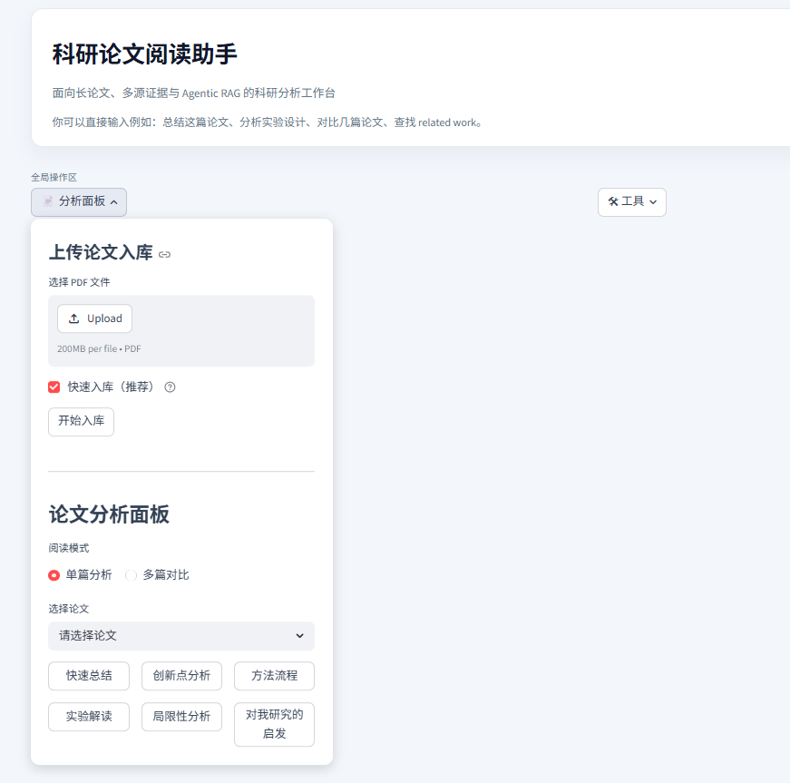
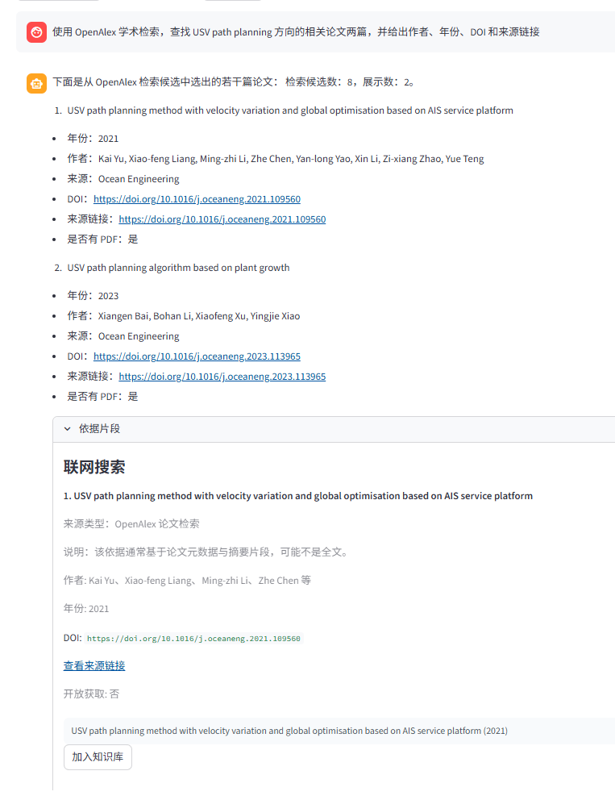
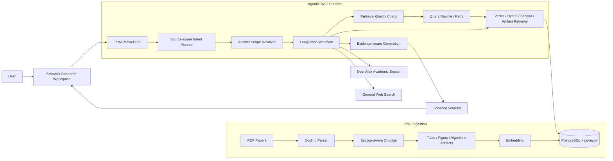
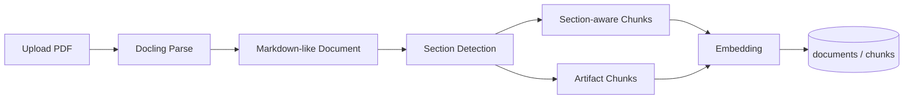
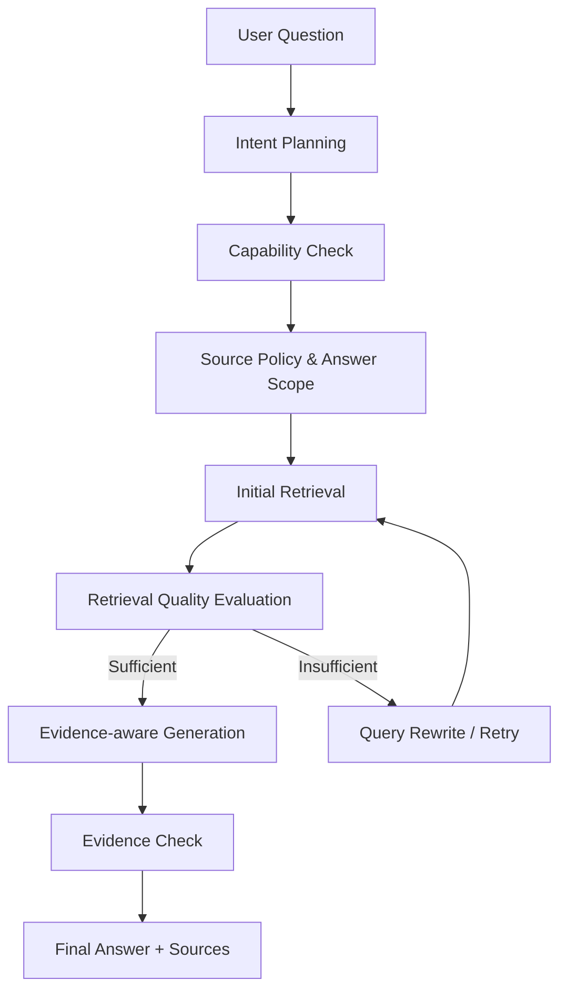

<div align="center">

# 📚 Agentic RAG Paper Assistant

**面向科研论文阅读、证据追踪与多源检索的 Agentic RAG 工作台**

基于 **FastAPI + Streamlit + PostgreSQL/pgvector + LangChain/LangGraph** 构建，支持 PDF 论文入库、章节级检索、图表/算法证据抽取、OpenAlex 学术检索、流式问答与可回归评测。

<br />


<br />

[项目简介](#-项目简介) ·
[核心能力](#-核心能力) ·
[设计权衡](#-设计权衡) ·
[界面预览](#️-界面预览) ·
[系统架构](#️-系统架构) ·
[快速开始](#-快速开始) ·
[评测与测试](#-评测与测试) ·
[项目结构](#-项目结构)

</div>

---



## 📌 项目简介

**Agentic RAG Paper Assistant** 是一个面向科研论文阅读场景的 Agentic RAG 工程项目。它不是简单的“向量检索 + LLM 总结”Demo，而是围绕长 PDF 论文的结构化入库、多源证据检索、来源边界控制和可追踪回答生成，构建了一套端到端科研分析工作流。

项目适合用于本地或私有化部署，覆盖论文总结、方法拆解、实验解读、创新点分析、多篇论文对比、related work 检索和证据追踪等典型科研阅读任务。

### 为什么不是普通 RAG？

普通 RAG 在论文场景中很容易遇到这些问题：

| 问题 | 项目中的处理方式 |
|---|---|
| 固定长度切块破坏章节边界 | 使用 section-aware chunking 保留章节路径、行号和分片信息 |
| 表格、图示、算法容易被正文检索忽略 | 将 table / figure / algorithm 抽取为可检索的 artifact evidence |
| 本地论文、OpenAlex、网页来源容易混淆 | 通过 Source-aware Planner 约束来源边界 |
| 检索不足时缺少恢复机制 | 使用 LangGraph 显式组织 retrieval evaluation / query rewrite / retry |
| 回答依据难验证 | 前端展示论文来源、章节、行号、相似度和依据片段 |

---

## ✨ 核心能力

| 能力 | 说明 |
|---|---|
| **Section-aware Ingestion** | 使用 Docling 解析 PDF，并基于 Markdown heading 识别论文结构，保留 `section_title`、`section_path_text`、行号和章节内分片。 |
| **Artifact Evidence Extraction & Retrieval** | 将表格、图示、算法/伪代码从正文中独立抽取为 `artifact chunk`，保留 caption、上下文与章节路径；Agent 可通过 `artifact_search` 直接检索这些非正文证据，而不是依赖正文描述间接召回。 |
| **Source-aware Intent Planner** | Planner 输出结构化 `IntentPlan`，包括 intent、是否需要检索、计划工具、来源约束和回答边界；运行时会根据能力开关过滤不可用工具，并在 Web / OpenAlex 不可用时进入 disclosure 策略，避免用本地论文证据冒充外部检索结果。 |
| **LangGraph Retrieval Workflow** | 将复杂问答拆成意图规划、范围解析、检索、质量评估、必要时重写与重试、证据检查和最终生成。 |
| **Evidence Tracing** | 回答可展开依据片段，展示本地论文、章节路径、行号、分片、相似度和 snippet，方便核对结论来源。 |
| **OpenAlex Academic Search** | 支持检索知识库外的论文元数据，包括作者、年份、DOI、venue、开放获取链接，并可将可访问论文加入知识库。 |
| **Streaming Research UI** | 基于 Streamlit 构建科研分析工作台，支持流式问答、工具开关、分析面板、历史会话和上传入库。 |
| **Long-session Memory Compression** | 长轮次论文分析中对上下文进行滚动摘要，保留讨论对象、用户约束、章节范围和来源限制，同时过滤 Planner / Tool 调试字段。 |

---

## 🧠 设计权衡

| 技术决策 | 设计考虑 |
|---|---|
| **LangGraph over one-shot RAG** | 论文问答经常需要规划、检索、评估、重试和证据检查。相比一次性 RAG chain，LangGraph 更适合管理带状态的多阶段工作流。 |
| **Planner before Tool Calling** | 不让 Agent 盲目调用所有工具，而是先生成结构化 `IntentPlan`，再由 Source Policy 和 runtime capabilities 约束工具调用，降低工具误用和来源混淆风险。 |
| **Artifact as Evidence Chunk** | 表格、图示、算法块独立存储，避免长表格稀释正文语义；当问题指向实验指标、流程图或伪代码时，可通过 `artifact_search` 精准召回。 |

---

## 🖼️ 界面预览

| Agentic 流式分析 | 证据追踪 |
|---|---|
|  |  |
| Planner 自动判断检索来源，并以流式状态展示规划、检索与生成过程。 | 展开依据片段后可查看论文来源、章节路径、行号、分片和相似度。 |

| 论文分析面板 | OpenAlex 学术检索 |
|---|---|
|  |  |
| 支持上传入库、单篇总结、创新点分析、方法拆解、实验解读和多篇对比。 | 支持 related work 检索，展示作者、年份、DOI、来源链接，并与本地知识库来源区分。 |

---

## 🏗️ 系统架构



### Source Types

| Source Type | 工具 / 来源 | 适用场景 | 设计边界 |
|---|---|---|---|
| `local_kb` | vector / hybrid search | 已上传论文的全文问答、总结、对比 | 作为本地论文证据，不冒充外部网页或学术检索结果 |
| `local_section` | section_search | 只看 Abstract / Method / Experiments / References 等章节 | 依赖章节 metadata，适合章节限定问题 |
| `local_artifact` | artifact_search | 表格、图示、算法、伪代码相关问题 | 作为非正文证据补充，用于实验指标、流程图和算法步骤 |
| `external_academic` | OpenAlex | related work、作者、年份、DOI、venue、开放获取链接 | 返回论文元数据和摘要线索，不等同于本地全文 |
| `general_web` | Web Search Provider | 通用网页资料、最新信息、非论文来源 | 可选能力，未配置时不会伪造联网结果 |
| `model_knowledge` | Direct Answer | 普通知识解释、无需证据的对话 | 不能替代本地论文证据 |

---

## 🔁 核心工作流

### 1. PDF 入库流程



入库阶段会同时保留正文证据和非正文证据：正文 chunk 用于常规论文问答，artifact chunk 用于表格、图示、算法等更细粒度的证据检索。

### 2. Agentic RAG 问答流程



Planner 默认遵循最小必要检索原则：能直答的问题不会强行检索；论文问题优先走本地知识库；外部论文发现才使用 OpenAlex；网页搜索仅在用户需求和配置都满足时启用。

在检索阶段，系统会记录每轮 retrieval attempts、top score、result count 和不足原因；当证据不足时，workflow 会进入 query rewrite / retry 分支，并将 rewritten queries 与最终 sources 一起写入 metadata，方便回溯检索行为。对于复杂问题，系统可以结合检索结果摘要判断当前证据是否覆盖问题要求，并在缺少章节、artifact 或目标文档证据时触发定向重查。

---

## 🧱 技术栈

| 层级 | 技术 |
|---|---|
| Frontend | Streamlit |
| Backend | FastAPI, Uvicorn, SSE |
| Agent Workflow | LangChain, LangGraph, Pydantic AI |
| Vector Store | PostgreSQL 17, pgvector, pg_trgm |
| PDF Parsing | Docling |
| Embedding / LLM | OpenAI-compatible API |
| Academic Search | OpenAlex |
| General Web Search | Tavily / SerpAPI / Brave / Bing / Bocha / Custom Provider |
| Testing | pytest, pytest-asyncio, pytest-mock |
| Deployment | Docker Compose |

---

## 🚀 快速开始

### 1. 克隆项目

```bash
git clone <your-repo-url>
cd agentic-rag-paper-assistant
```

### 2. 配置环境变量

```bash
cp .env.example .env
```

至少需要配置 OpenAI-compatible 模型与 embedding 服务：

```env
OPENAI_API_KEY=your_api_key
OPENAI_BASE_URL=https://your-openai-compatible-endpoint/v1
LLM_CHOICE=gpt-4o-mini
EMBEDDING_MODEL=text-embedding-3-small
```

可选外部检索能力：

```env
OPENALEX_API_KEY=your_openalex_key
OPENALEX_MAILTO=you@example.com

GENERAL_WEB_SEARCH_ENABLED=false
GENERAL_WEB_SEARCH_PROVIDER=custom
GENERAL_WEB_SEARCH_API_KEY=your-web-search-key
GENERAL_WEB_SEARCH_ENDPOINT=https://example.com/search
```

### 3. 启动服务

```bash
docker compose up -d --build
```

默认服务地址：

| 服务 | 地址 |
|---|---|
| Streamlit UI | http://localhost:8502 |
| FastAPI Backend | http://localhost:8059 |
| API Docs | http://localhost:8059/docs |
| PostgreSQL | localhost:6544 |

健康检查：

```bash
curl http://localhost:8059/health/live
curl http://localhost:8059/health
```

### 4. 导入论文

方式一：在 UI 的“上传论文入库”面板上传 PDF。

方式二：将 PDF 放入 `documents/` 后执行：

```bash
docker compose exec api python -m ingestion.ingest --documents documents --fast --verbose
```

完整解析模式会保留图片/表格解析和语义切分，适合正式构建知识库：

```bash
docker compose exec api python -m ingestion.ingest --documents documents --verbose
```

---

## 💬 使用示例

### 本地论文问答

```text
总结知识库里 Hybrid-RRT 这篇论文的研究问题、核心方法和创新点。
```

```text
只看 Experiments 章节，分析这篇论文的实验设置是否充分。
```

```text
对比 HA-RRT、HMA-RRT 和 Hybrid-RRT 的方法差异、适用场景和局限性。
```

### 图表 / 算法证据问答

```text
只根据论文中的表格、图示或算法描述，说明 Hybrid-RRT 的流程特点。
```

```text
根据表格证据，分析不同路径规划方法的实验指标差异。
```

### 外部论文检索

```text
帮我找几篇 USV path planning 相关论文，给出作者、年份、DOI 和来源。
```

```text
结合知识库论文，补充几篇相关 related work。
```

---

## 📊 评测与测试

项目将 Agentic RAG 拆成多个工程责任进行轻量回归验证，而不是只用单一分数评价效果。

### Engineering Snapshot

| 指标 | 当前结果 |
|---|---:|
| Tests | **130 passed** |
| Indexed documents | 3 |
| Total chunks | 476 |
| Section metadata coverage | 100% |
| Line metadata coverage | 100% |
| Artifact chunks | 147 |
| Empty chunks | 0 |
| Source-boundary violations | 0 |

### Evaluation Suites

| Suite | 验证目标 | README 展示口径 |
|---|---|---|
| Ingestion Integrity | PDF 入库后是否保留章节、行号、artifact 证据 | Stable Metric |
| Source Policy | Planner 是否遵守 local / OpenAlex / Web 来源边界 | Stable Metric |
| Retrieval Contract | 检索工具是否命中特定场景并保留 metadata | Diagnostic |
| Retrieval Loop Diagnostics | 检索评估、query rewrite、retry 和 cue 保留情况 | Diagnostic |
| Answer Groundedness Audit | 检查未支撑断言、来源边界和证据差距披露 | Quality Gate |

运行完整评测：

```bash
python evals/run_all_evals.py --limit 3
```

运行测试：

```bash
pytest
```

---

## 🔌 API 概览

| Method | Path | 说明 |
|---|---|---|
| `GET` | `/health/live` | 轻量存活检查 |
| `GET` | `/health` | 数据库和模型连接检查 |
| `POST` | `/chat` | 非流式问答 |
| `POST` | `/chat/stream` | SSE 流式问答 |
| `POST` | `/chat/stream/{run_id}/cancel` | 取消流式生成 |
| `POST` | `/search/vector` | 向量检索 |
| `POST` | `/search/hybrid` | 混合检索 |
| `GET` | `/documents` | 查看知识库文档 |
| `POST` | `/documents/upload/start` | 异步上传并入库 PDF |
| `GET` | `/documents/upload/jobs/{job_id}` | 查询入库任务状态 |
| `POST` | `/documents/upload/jobs/{job_id}/cancel` | 取消入库任务 |
| `GET` | `/sessions` | 最近会话列表 |
| `GET` | `/sessions/{session_id}/messages` | 会话消息 |
| `GET` | `/openalex/status` | OpenAlex 能力状态 |
| `GET` | `/web-search/status` | 通用网页搜索能力状态 |
| `POST` | `/openalex/add-to-kb` | 将可访问 OpenAlex 论文加入知识库 |

---

## 📁 项目结构

```text
.
├── agent/                  # FastAPI、Agent runtime、LangGraph workflow、tools、planner
├── ingestion/              # PDF 解析、section-aware chunking、artifact extraction、embedding 入库
├── ui/                     # Streamlit research workspace
├── sql/                    # PostgreSQL + pgvector schema and search functions
├── evals/                  # Ingestion / Source Policy / Retrieval / Groundedness evals
├── tests/                  # Planner、LangGraph、DB、chunker、UI、stream cancel 等测试
├── docs/                   # 项目文档与 README 图片资源
├── docker-compose.yml      # API / UI / PostgreSQL 服务编排
├── Dockerfile
└── pyproject.toml
```

---

## 🧭 后续优化方向

- **Page-level Evidence Mapping**：进一步将 evidence 映射到 PDF 页码和页面区域，提升论文核查体验。
- **Persistent Ingestion Queue**：将入库任务状态迁移到 Redis / Celery 等持久化任务队列，增强生产环境稳定性。
- **Grounded Answer Refinement**：继续优化数字断言、机制推断和证据引用的自动审计与修正能力。

---

## 📄 License

MIT License

