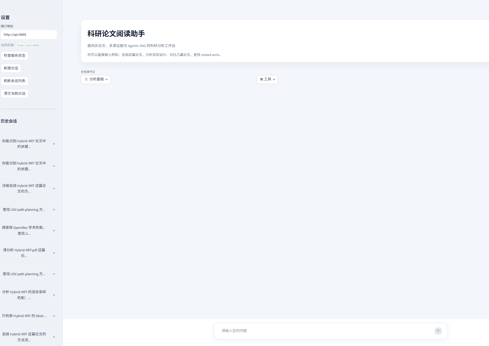
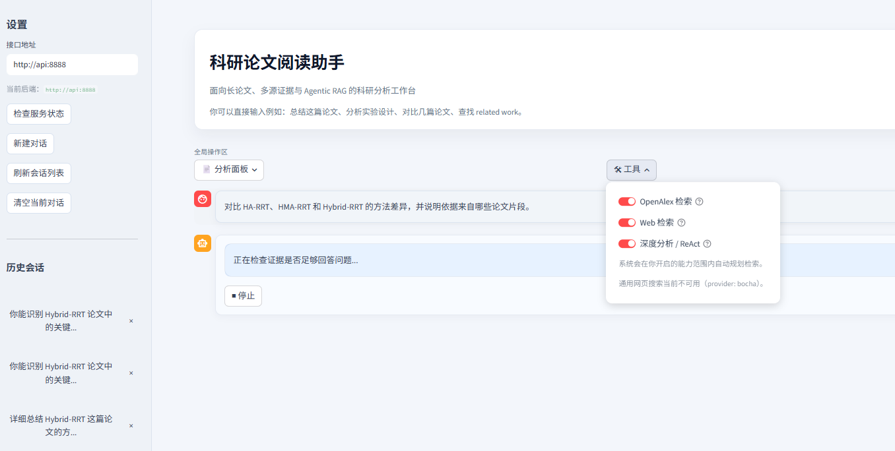
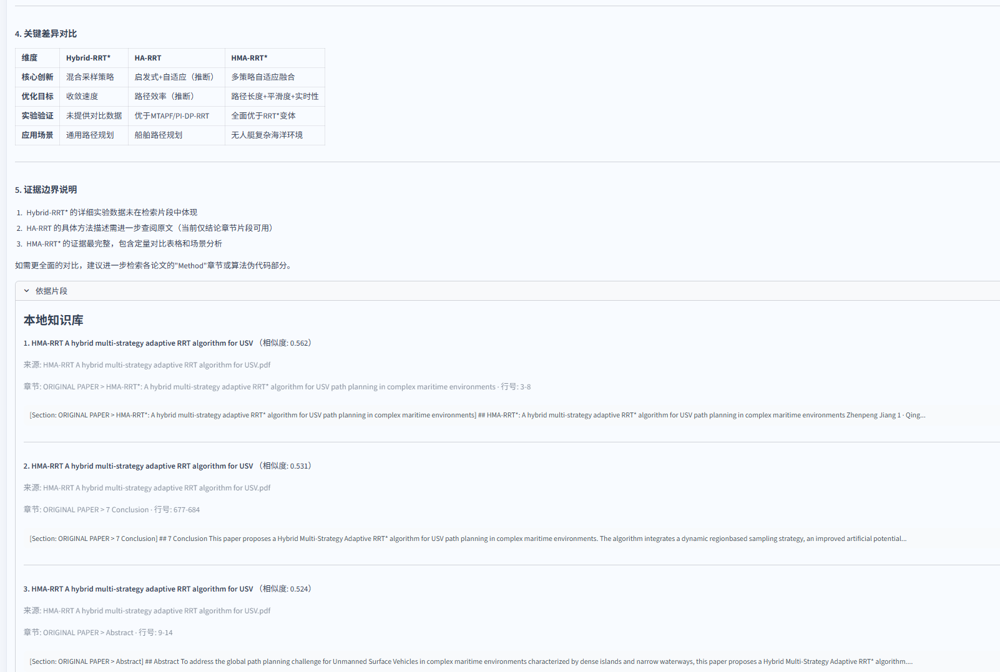
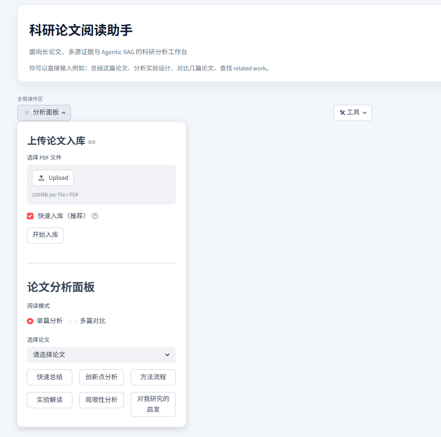
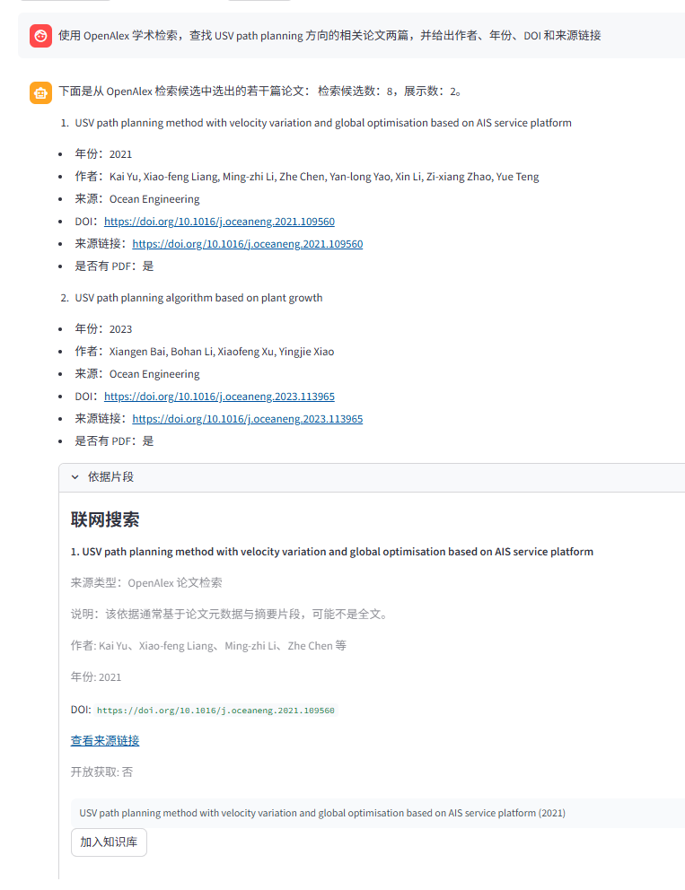
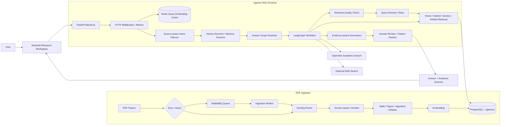
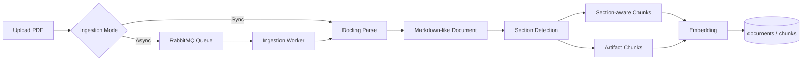
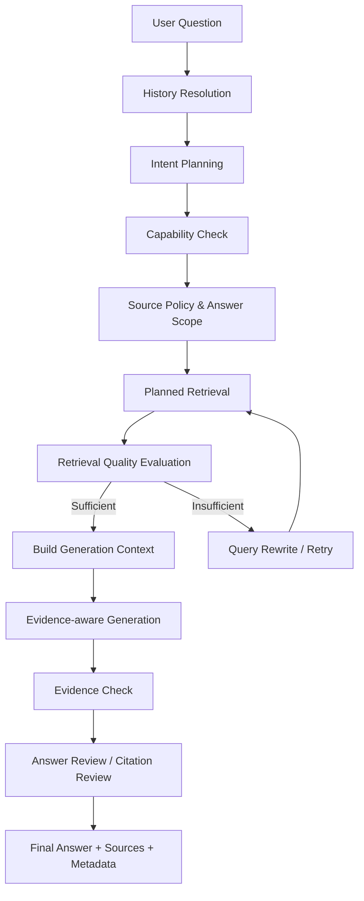

<div align="center">

# 📚 Agentic RAG Paper Assistant

**面向科研论文阅读、证据追踪与多源检索的 Agentic RAG 工程工作台**

基于 **FastAPI + Streamlit + PostgreSQL/pgvector + LangChain/LangGraph** 构建，支持 PDF 论文结构化入库、章节级检索、图表/算法证据抽取、OpenAlex 学术检索、流式多轮问答、证据引用审查与可回归评测；同时提供 **RabbitMQ 异步入库、Redis 查询缓存、运行时指标、健康检查和请求中间件**，便于在本地或私有化环境中稳定处理较耗时的论文分析任务。

<br />


<br />

[项目简介](#-项目简介) ·
[核心能力](#-核心能力) ·
[工程亮点](#-工程亮点) ·
[界面预览](#-界面预览) ·
[系统架构](#-系统架构) ·
[快速开始](#-快速开始) ·
[测试与评测](#-测试与评测) ·
[项目结构](#-项目结构) ·
[Roadmap](#-roadmap)

</div>

---



## 📌 项目简介

**Agentic RAG Paper Assistant** 是一个面向科研论文阅读场景的 Agentic RAG 系统。它不是简单的“向量检索 + LLM 总结”Demo，而是围绕长 PDF 论文的结构化入库、多源证据检索、来源边界控制、多轮上下文管理和可追踪回答生成，构建了一套端到端的论文分析工作流。

项目覆盖论文总结、方法拆解、实验解读、创新点分析、多篇论文对比、related work 检索和私有论文知识库问答等场景。对于较大的 PDF 或批量入库任务，系统支持将解析、切块、embedding 与向量入库交给 RabbitMQ worker 后台处理，避免长任务阻塞前端请求。

### 为什么不只是普通 RAG？

普通 RAG 在论文场景中容易遇到这些问题：

| 问题 | 项目中的处理方式 |
|---|---|
| 固定长度切块破坏章节边界 | 使用 section-aware chunking 保留章节路径、行号和分片信息 |
| 表格、图示、算法证据容易被正文检索忽略 | 将 table / figure / algorithm 抽取为独立 artifact evidence |
| 本地论文、OpenAlex、网页和模型知识容易混淆 | 使用 source-aware planner 与 source policy 约束来源边界 |
| 初次检索不足时缺少恢复机制 | 使用 LangGraph 显式组织 retrieval grading、query rewrite 和 retry |
| 多轮论文分析容易污染上下文 | 使用 history resolver、dialog policy 和 memory runtime 压缩会话记忆 |
| 回答依据难以验证 | 生成阶段注入 evidence references，并进行 answer review 与 citation review |
| PDF 入库任务耗时 | 支持 RabbitMQ 异步任务队列和 worker 后台入库 |
| 重复 embedding 成本高 | 使用 Redis query embedding cache，缓存不可用时自动降级 |

---

## ✅ 核心能力

| 能力 | 说明 |
|---|---|
| **Section-aware Ingestion** | 使用 Docling 解析 PDF，并基于 Markdown heading 识别论文结构，保留 `section_title`、`section_path_text`、行号范围和章节内分片。 |
| **Artifact Evidence Extraction** | 将表格、图示、算法、伪代码等非正文信息抽取为独立 evidence chunk，保留 caption、上下文和章节路径。 |
| **Source-aware Intent Planner** | Planner 输出结构化 `IntentPlan`，区分用户意图、目标来源、可用工具、不可用能力和回答边界。 |
| **LangGraph Agent Workflow** | 将复杂问答拆成意图规划、文档检查、范围解析、检索规划、检索执行、质量评估、重写重试、生成、证据检查、回答审查和最终整理。 |
| **Multi-turn Memory** | 支持会话历史解析、问题补全、上下文压缩和多轮约束继承，适合连续分析同一篇或多篇论文。 |
| **Evidence Citation Review** | 为检索片段生成编号引用，要求关键事实声明带引用标记，并记录缺失引用、非法引用、引用与证据不一致的断言和证据覆盖风险。 |
| **Answer Review Runtime** | 对本地论文问答中的未支撑数字、机制断言和证据缺口进行轻量审查，必要时追加风险提示。 |
| **Fast Chat Path** | 对普通聊天、简单解释和无需检索的问题走轻量路径，避免所有请求都进入重型 RAG workflow。 |
| **Async Ingestion** | 支持 RabbitMQ 任务投递、worker 消费、任务状态记录和失败信息回传，适合批量 PDF 入库。 |
| **Redis Cache & Degrade** | 对 query embedding 做短期缓存，Redis 不可用时自动 fallback，不影响主流程可用性。 |
| **Runtime Middleware** | 提供 request id、请求大小限制、轻量限流、安全响应头、异常格式化和 runtime metrics。 |
| **Health & Readiness** | 提供运行时健康检查、组件可用性检查和配置快照，便于 Docker/部署环境排查。 |
| **Evaluation Toolkit** | 提供入库质量、来源边界、检索契约、检索循环恢复和回答 groundedness 等评测脚本。 |

---

## 🧠 工程亮点

### 1. Source 不等于 Tool

项目没有把“选择工具”当成完整规划，而是先区分信息来源：

| Source Type | 工具 / 来源 | 适用场景 | 设计边界 |
|---|---|---|---|
| `local_kb` | vector / hybrid search | 已上传论文的全文问答、总结、对比 | 作为本地论文证据，不冒充外部网页或学术检索结果 |
| `local_section` | section_search | 只看 Abstract / Method / Experiments / References 等章节 | 依赖章节 metadata，适合章节限定问题 |
| `local_artifact` | artifact_search | 表格、图示、算法、伪代码相关问题 | 作为非正文证据补充，用于实验指标、流程图和算法步骤 |
| `external_academic` | OpenAlex | related work、作者、年份、DOI、venue、开放获取链接 | 返回论文元数据和摘要线索，不等同于本地全文 |
| `general_web` | Web Search Provider | 通用网页资料、最新信息、非论文来源 | 可选能力，未配置时不会伪造联网结果 |
| `model_knowledge` | Direct Answer | 普通知识解释、无须证据的对话 | 不能替代本地论文证据 |

这个设计让回答生成前的来源选择、工具调用和结果解释更清晰，也方便在多源检索场景下保留可追踪的证据链。

### 2. LangGraph 节点化工作流

当前深度分析链路已经从单一大节点拆成更清晰的阶段：

```text
initial_intent_planning
  -> inspect_documents
  -> resolve_answer_scope
  -> plan_retrieval
  -> execute_retrieval
  -> grade_retrieval
  -> decide_after_grade
  -> rewrite_query
  -> build_generation_context
  -> generate_answer
  -> evidence_check
  -> answer_review
  -> finalize
```

每个阶段都有明确职责，检索失败、来源不可用、证据不足、回答越界等状态都会写入 metadata，便于观察、测试和回归。

### 3. 证据驱动的回答生成

系统会把检索结果整理成可引用的 evidence references，生成回答时要求关键事实声明尽量标注 `[1]`、`[2]` 这类证据编号。生成后再通过 citation review 检查：

- 是否引用了不存在的 evidence id；
- 是否存在关键事实声明没有引用；
- 引用的证据是否支持该事实声明，避免将不匹配的数字或结论归因给正确的编号；
- evidence reference 数量是否足够；
- citation risk 是否需要写入 metadata。

这套机制把“回答是否有依据”从纯 prompt 约束前移到 runtime 层，适合在论文问答、实验对比和方法总结等场景中提升可核查性。

### 4. 异步入库与可降级中间件

PDF 解析和 embedding 是典型慢任务。项目提供两条路径：

- 小文件或本地调试可以同步入库；
- 批量 PDF 或较大文件可以投递到 RabbitMQ，由 worker 后台处理。

Redis 只作为轻量缓存层，不替代 PostgreSQL/pgvector 的主存储。RabbitMQ 和 Redis 都设计成可选增强能力，不可用时主流程可以降级或给出明确错误，而不是静默失败。

数据库初始化脚本可重复执行：仅在表和索引不存在时创建对象，不会在服务启动或部署时删除已有论文、会话和入库任务数据。

### 5. 面向部署的运行时能力

后端不仅提供核心问答接口，还补充了真实工程项目常见的基础设施：

- request id 注入；
- 统一错误响应；
- 请求大小限制；
- 简单限流；
- 安全响应头；
- runtime metrics；
- health / readiness；
- 配置读取与运行时快照。

这些能力让系统不仅能完成本地演示，也便于在 Docker、本地服务和私有化部署环境中进行排查与维护。

---

## 🖼 界面预览

| Agentic 流式分析 | 证据追踪 |
|---|---|
|  |  |
| Planner 自动判断检索来源，并以流式状态展示规划、检索与生成过程。 | 展开依据片段后可查看论文来源、章节路径、行号、分片和相似度。 |

| 论文分析面板 | OpenAlex 学术检索 |
|---|---|
|  |  |
| 支持上传入库、单篇总结、创新点分析、方法拆解、实验解读和多篇对比。 | 支持 related work 检索，展示作者、年份、DOI、来源链接，并与本地知识库来源区分。 |

---

## 🏗 系统架构


```mermaid
flowchart LR
    User[User] --> UI[Streamlit Research Workspace]
    UI --> API[FastAPI Backend]

    subgraph Ingestion[PDF Ingestion]
        PDF[PDF Papers] --> Mode{Sync / Async}
        Mode --> Docling[Docling Parser]
        Mode --> Queue[RabbitMQ Queue]
        Queue --> Worker[Ingestion Worker]
        Worker --> Docling
        Docling --> Chunker[Section-aware Chunker]
        Chunker --> Artifact[Table / Figure / Algorithm Artifacts]
        Artifact --> Embed[Embedding]
        Embed --> Store[(PostgreSQL + pgvector)]
    end

    subgraph Runtime[Agentic RAG Runtime]
        API --> Middleware[HTTP Middleware / Metrics]
        Middleware --> Cache[(Redis Query Embedding Cache)]
        Middleware --> Planner[Source-aware Intent Planner]
        Planner --> Memory[History Resolver / Memory Runtime]
        Memory --> Scope[Answer Scope Resolver]
        Scope --> Graph[LangGraph Workflow]
        Graph --> Local[Vector / Hybrid / Section / Artifact Retrieval]
        Local --> Store
        Graph --> Quality[Retrieval Quality Check]
        Quality --> Rewrite[Query Rewrite / Retry]
        Rewrite --> Local
        Graph --> Generate[Evidence-aware Generation]
        Generate --> Review[Answer Review / Citation Review]
    end

    Graph --> OpenAlex[OpenAlex Academic Search]
    Graph --> Web[Optional Web Search]
    Review --> Sources[Answer + Evidence Sources]
    Sources --> UI
```

### PDF 入库流程


```mermaid
flowchart LR
    A[Upload PDF] --> M{Ingestion Mode}
    M -->|Sync| B[Docling Parse]
    M -->|Async| Q[RabbitMQ Queue]
    Q --> W[Ingestion Worker]
    W --> B
    B --> C[Markdown-like Document]
    C --> D[Section Detection]
    D --> E[Section-aware Chunks]
    D --> F[Artifact Chunks]
    E --> G[Embedding]
    F --> G
    G --> H[(documents / chunks)]
```

### Agentic RAG 问答流程


```mermaid
flowchart TD
    Q[User Question] --> H[History Resolution]
    H --> P[Intent Planning]
    P --> C[Capability Check]
    C --> S[Source Policy & Answer Scope]
    S --> R[Planned Retrieval]
    R --> G[Retrieval Quality Evaluation]
    G -->|Sufficient| B[Build Generation Context]
    G -->|Insufficient| W[Query Rewrite / Retry]
    W --> R
    B --> A[Evidence-aware Generation]
    A --> E[Evidence Check]
    E --> V[Answer Review / Citation Review]
    V --> F[Final Answer + Sources + Metadata]
```

---

## 🧰 技术栈

| 层级 | 技术 |
|---|---|
| Frontend | Streamlit |
| Backend | FastAPI, Uvicorn, SSE |
| Agent Workflow | LangChain, LangGraph |
| Vector Store | PostgreSQL 17, pgvector, pg_trgm |
| Async Task | RabbitMQ, ingestion worker |
| Cache | Redis query embedding cache |
| PDF Parsing | Docling |
| Embedding / LLM | OpenAI-compatible API |
| Academic Search | OpenAlex |
| General Web Search | Tavily / SerpAPI / Brave / Bing / Bocha / Custom Provider |
| Observability | request id, runtime metrics, health/readiness |
| Testing | pytest, pytest-asyncio, pytest-mock |
| Deployment | Docker Compose |

---

## 🚀 快速开始

### 1. 配置环境变量

```bash
cp .env.example .env
```

至少需要配置 OpenAI-compatible 模型和 embedding 服务：

```env
OPENAI_API_KEY=your_api_key
OPENAI_BASE_URL=https://your-openai-compatible-endpoint/v1
LLM_MODEL=your-chat-model
EMBEDDING_MODEL=your-embedding-model
```

如果需要 OpenAlex 以外的通用网页搜索，可按需配置 Tavily、SerpAPI、Brave、Bing、Bocha 或自定义 provider。

### 2. 使用 Docker Compose 启动

```bash
docker compose up -d
```

默认会启动：

- PostgreSQL + pgvector；
- FastAPI backend；
- Streamlit UI；
- Redis；
- RabbitMQ；
- ingestion worker。

如果只想复用已有容器，不希望重建镜像，可以使用：

```bash
docker compose up -d --no-build
```

### 3. 访问服务

```text
Streamlit UI: http://localhost:8501
FastAPI Docs: http://localhost:8000/docs
RabbitMQ UI: http://localhost:15672
```

### 4. 常用健康检查

```bash
curl http://localhost:8000/health
curl http://localhost:8000/readiness
```

---

## 🧪 测试与评测

项目包含核心单元测试、真实链路测评和工程化展示测评，用于回归检查入库、检索、来源边界、检索恢复、中间件、缓存降级和多轮记忆等关键链路。

```bash
# 核心 Agent / runtime / middleware 测试
.venv\Scripts\python.exe -m pytest tests\agent\test_evidence_citation_runtime.py tests\agent\test_agent_langgraph_retrieval_loop.py tests\agent\test_langgraph_analysis_context.py tests\agent\test_answer_review_runtime.py tests\agent\test_http_runtime.py tests\agent\test_runtime_config.py tests\agent\test_memory_runtime.py tests\agent\test_dialog_policy.py tests\agent\test_prompt_registry.py tests\agent\test_simple_chat_runtime.py -q

# 真实链路展示报告
python evals/run_real_chain_eval.py

# 工程化展示测评
python evals/run_engineering_showcase_eval.py
```

当前报告位于 `evals/results/real_chain_eval.md` 和 `evals/results/engineering_showcase_eval.md`。详细设计见 [docs/EVALUATION.md](docs/EVALUATION.md) 与 [evals/README.md](evals/README.md)。

涉及 PDF 解析和完整入库的链路推荐使用 Docker 环境验证，便于复现 Docling、torch 和系统依赖。

---

## 📁 项目结构

```text
agentic_rag_project-main2/
├── agent/
│   ├── agent_langgraph.py              # LangGraph 深度分析主工作流
│   ├── intent_planner.py               # Source-aware intent planning
│   ├── planner_runtime.py              # Planner 运行时与 fallback
│   ├── tools.py                        # 本地检索、OpenAlex、Web 等工具入口
│   ├── tool_specs.py                   # 工具协议与 capability 描述
│   ├── history_resolver.py             # 多轮问题补全
│   ├── dialog_policy.py                # 对话策略与轻重链路选择
│   ├── memory_runtime.py               # 会话记忆压缩与快照
│   ├── simple_chat_runtime.py          # 非检索问题轻量回答路径
│   ├── answer_review_runtime.py        # 回答证据风险审查
│   ├── evidence_citation_runtime.py    # evidence 引用构建与引用审查
│   ├── evidence_support_policy.py       # 引用事实与证据片段的一致性检查
│   ├── prompt_registry.py              # Prompt registry 与兼容层
│   ├── rabbitmq_producer.py            # 异步入库任务投递
│   ├── ingestion_worker.py             # RabbitMQ worker 消费与入库
│   ├── cache_utils.py                  # Redis query embedding cache
│   ├── http_middleware.py              # 请求中间件、限流、安全头
│   ├── runtime_metrics.py              # 运行时指标
│   ├── health_runtime.py               # health/readiness 组件检查
│   └── api.py                          # FastAPI API 层
├── ingestion/
│   ├── ingest.py                       # PDF 入库主流程
│   ├── extract_files.py                # Docling PDF 解析
│   └── chunking.py                     # section-aware chunking
├── ui/
│   └── streamlit_app.py                # Streamlit 研究工作台
├── evals/
│   ├── run_all_evals.py
│   ├── run_ingestion_quality_eval.py
│   ├── run_sample_ingestion_eval.py
│   ├── run_source_policy_eval.py
│   ├── run_retrieval_quality_eval.py
│   ├── run_retrieval_loop_recovery_eval.py
│   └── run_answer_groundedness_eval.py
├── docs/
│   ├── DESIGN.md
│   ├── EVALUATION.md
│   ├── RABBITMQ_ASYNC_INGESTION.md
│   └── REDIS_CACHE.md
├── tests/
│   ├── agent/
│   ├── ingestion/
│   └── evals/
├── sql/
├── docker-compose.yml
├── Dockerfile
└── README.md
```

---

## 🧭 Roadmap

- 增强 PDF 页码级 evidence 映射，让回答引用可以进一步定位到原文页面。
- 完善异步入库任务的进度展示、失败重试和批量任务管理。
- 扩展多文档对比、related work 分析和结构化论文卡片导出能力。
- 补充更完整的端到端评测数据集，覆盖论文总结、方法对比、实验指标检索和多轮追问场景。

---

## 📄 License

This project is licensed under the MIT License. See [LICENSE](LICENSE) for details.
