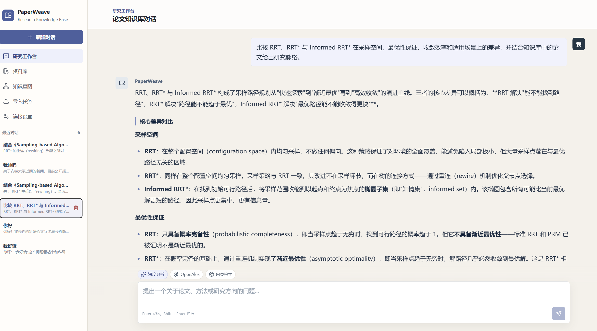
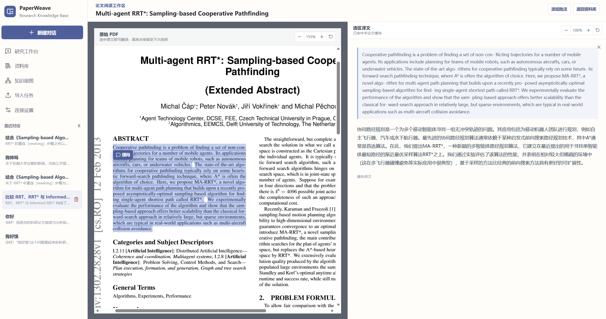
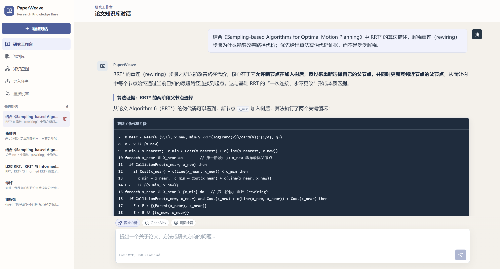
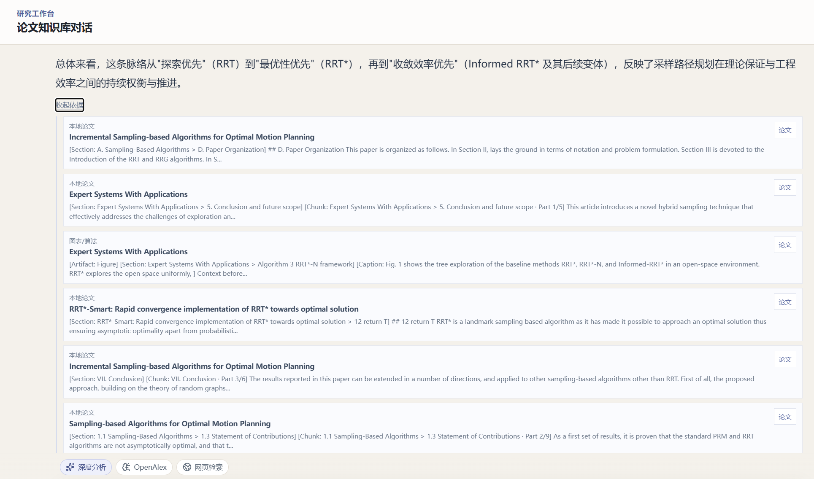
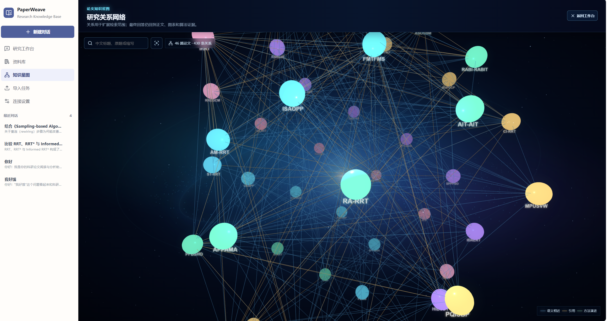
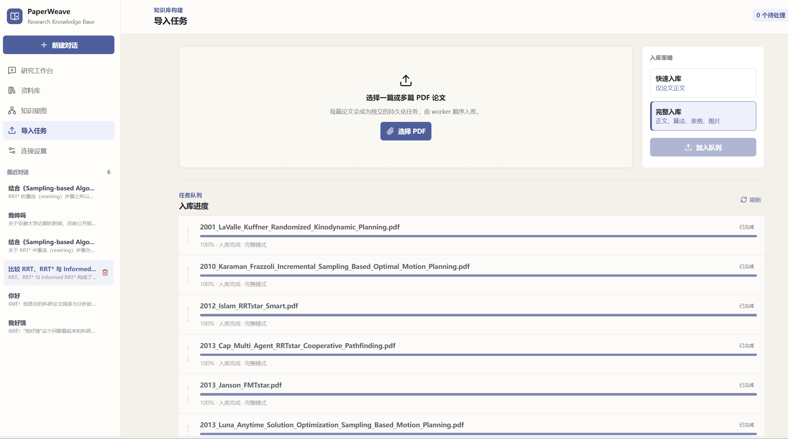
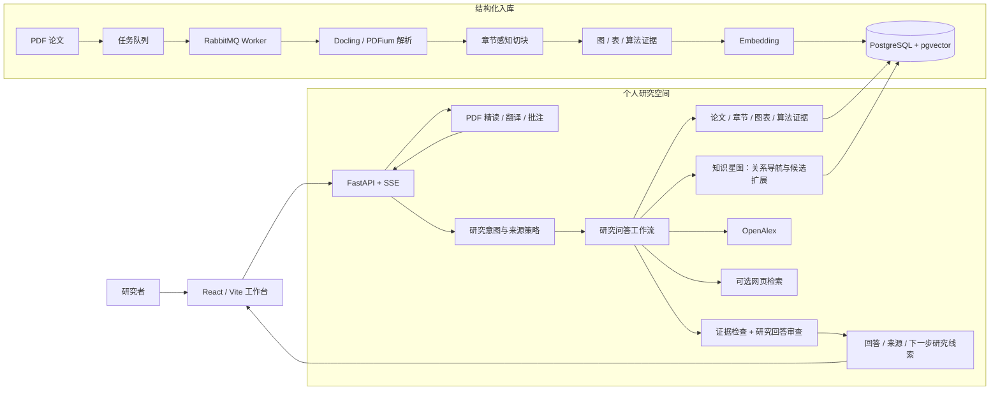

<div align="center">

# PaperWeave

**面向个人研究者的论文知识空间与研究发现助手**

从论文入库、原文精读到知识星图与研究问答，帮助研究者沉淀自己的文献脉络，理解方法关系，并在可靠证据约束下发现可迁移思路与潜在创新点。

<br />


<br />

[项目简介](#-项目简介) ·
[核心能力](#-核心能力) ·
[界面预览](#-界面预览) ·
[系统架构](#-系统架构) ·
[快速开始](#-快速开始) ·
[评测结果](#-评测结果) ·
[项目结构](#-项目结构)

</div>

---



[观看完整功能演示（静音，约 88 秒）](docs/assets/paperweave-demo.mp4)

## 📌 项目简介

**PaperWeave** 是面向个人研究型用户的长期论文知识空间：研究者不是“上传一篇、问一个问题”，而是持续把文献沉淀为可阅读、可关联、可检索、可追问的个人研究网络。

1. **沉淀个人论文库**：把正文、章节、图表、算法、批注与原始 PDF 留在同一个可持续更新的知识底座中。
2. **在阅读中建立理解**：在原文中划词翻译、批注和追问，不离开当前阅读上下文。
3. **从关系中导航研究**：把每篇论文映射为中文可读的知识星图节点，沿相似性、引用和方法谱系理解研究脉络。
4. **让助手辅助研究发现**：助手按问题选择论文、章节、算法/图表、星图候选关系或外部学术元数据，给出可回溯结论、方法迁移线索与创新讨论的起点。

系统适合构建任意研究方向的个人论文库，例如 RRT、运动规划、机器人、控制、视觉或其他领域。知识星图用于扩展思考与候选发现；对论文事实、实验数字和方法细节的结论始终回到入库原文，外部 OpenAlex 与网页信息也会明确区分来源。

### 研究者真正需要什么？

| 研究过程中的断点 | PaperWeave 的处理方式 |
|---|---|
| 论文读完即散，无法形成长期积累 | 将原文、结构、翻译、批注、图表和算法留存在个人知识空间 |
| 难以把一篇论文放回研究脉络 | 星图展示相似工作、引用与方法谱系，节点和关系均可继续查看 |
| 看懂局部文字却不易把握方法关系 | 从选区、章节、算法、实验或跨论文关系发起上下文问答 |
| 创新讨论容易脱离已有工作 | 图谱只提供候选扩展，最终回答必须回到原文证据并标明边界 |
| 大批文献进入库后不可控 | 任务队列支持顺序、进度、暂停、恢复、删除和额度保护 |
| 学术术语翻译前后不一致 | 全文术语 profile + 选区缓存，保留缩写、公式、数字与引用 |

---

## ✅ 核心能力

| 能力 | 说明 |
|---|---|
| **个人知识空间** | 以论文为长期单位保存原文、结构、证据、翻译、批注与关系，而不是一次性上传文件。 |
| **研究关系星图** | 每篇论文以完整标题缩写为发光节点；提供中文的研究问题、核心方法、创新点、关键词和关系解读。 |
| **创新与迁移辅助** | 面向“该方法可迁移到哪里”“哪些工作值得比较”“研究缺口在哪里”等问题，图谱与原文共同提供可追溯的讨论起点。 |
| **上下文精读** | 原文可缩放、划词高亮、术语一致的中文翻译、批注以及“提问”入口都在同一阅读界面。 |
| **可管理的持续入库** | 多选 PDF 后按用户顺序处理；可暂停、恢复、重排、删除，额度不足时停止占用资源并保留文件。 |
| **多粒度证据** | 不只检索正文：章节、图、表、算法与伪代码都可成为回答依据。 |
| **可信研究问答** | 回答可展开至论文与片段；本地原文、星图导航、OpenAlex、网页和直接回答保持来源边界。 |
| **跨语言研究体验** | 中文问题可检索英文语料；全文术语 profile 与选区缓存降低重复翻译并保持术语一致。 |

---

## 🖼 界面预览

### 1. 研究工作台：多轮论文问答


在单篇、选定多篇或整个知识库范围内提问。复杂问题可进入深度分析路径，流式生成期间只标记最新回复，并自动跟随至最新对话。

### 2. 原文划词、上下文翻译与提问



选择 PDF 原文后，左侧高亮保留至下一次选择或点击选区外；右侧先利用全文术语 profile 再翻译选区。术语、公式、数字、引用和缩写保持一致，命中缓存时直接复用。

### 3. 算法与伪代码证据问答



对于算法流程、伪代码、图表或实验结果类问题，系统可以使用独立 artifact evidence，而不是只检索正文段落。

### 4. 来源与证据展开



回答的“查看依据”会展开来源类型、论文标题、章节/片段摘要以及可打开的论文入口。来源展示是回答可核查链路的一部分，而不是装饰性引用。

### 5. 论文关系知识星图



银河背景中的发光节点代表论文。关系边用于相似工作、引用和方法谱系导航；点击节点或边可聚焦关系并查看中文信息，旋转随聚焦停止。图谱服务于候选检索与创新启发，不作为事实证据本身。

### 6. 批量入库与任务管理



一次选择多篇 PDF，查看进度并调整队列。完整入库会处理正文、算法、表格与图片；快速入库只处理正文。任务可以暂停、恢复或删除。

---

## 🏗 系统架构


```mermaid
flowchart LR
    User[研究者] --> UI[React / Vite 工作台]
    UI --> API[FastAPI + SSE]

    subgraph Ingestion[结构化入库]
        PDF[PDF 论文] --> Queue[任务队列]
        Queue --> Worker[RabbitMQ Worker]
        Worker --> Parse[Docling / PDFium 解析]
        Parse --> Chunk[章节感知切块]
        Chunk --> Artifact[图 / 表 / 算法证据]
        Artifact --> Embed[Embedding]
        Embed --> Store[(PostgreSQL + pgvector)]
    end

    subgraph Research[个人研究空间]
        API --> Reader[PDF 精读 / 翻译 / 批注]
        API --> Planner[研究意图与来源策略]
        Planner --> Graph[研究问答工作流]
        Graph --> Local[论文 / 章节 / 图表 / 算法证据]
        Local --> Store
        Graph --> PaperGraph[知识星图：关系导航与候选扩展]
        PaperGraph --> Store
        Graph --> OpenAlex[OpenAlex]
        Graph --> Web[可选网页检索]
        Graph --> Review[证据检查 + 研究回答审查]
        Review --> Answer[回答 / 来源 / 下一步研究线索]
    end

    Reader --> API
    Answer --> UI
```

### 入库链路

```text
选择多篇 PDF
  -> 创建持久化入库任务
  -> RabbitMQ worker 顺序消费
  -> Docling 解析结构、保存 PDF 与图片资产
  -> 章节感知切块 + 图/表/算法 artifact
  -> embedding + PostgreSQL/pgvector
  -> 更新知识图谱节点与关系
```

### 研究发现与问答链路

```text
研究问题 + 选定论文范围
  -> 历史、当前研究对象与意图解析
  -> 来源策略（论文 / 章节 / 图表算法 / 星图 / OpenAlex / 网页 / direct）
  -> 按需以星图扩展候选论文
  -> 计划检索与质量检查
  -> 必要时 query rewrite / retry
  -> 证据约束回答、来源展示、关系边界与研究启发
```

### 来源边界

| 来源类型 | 典型工具 | 用途 | 回答约束 |
|---|---|---|---|
| 本地论文正文 | `hybrid_search` / `vector_search` | 概念、方法、结论、跨论文比较 | 作为原文证据 |
| 限定章节 | `section_search` | 摘要、引言、方法、实验、结论等限定问题 | 只使用命中的章节范围 |
| 图表与算法 | `artifact_search` | 伪代码步骤、图示结构、表格指标 | 不从未展示内容虚构定量结论 |
| 论文关系图 | 图谱关系运行时 | 发现相近、引用、方法谱系、可比较工作与迁移候选 | 只能导航，不能单独证明事实 |
| OpenAlex | `search_openalex_papers` | related work 与学术元数据 | 只展示实际返回元数据 |
| 通用网页 | `search_web` | 时效性、非论文信息 | 未配置时明确说明不可用 |
| 直接回答 | 无检索 | 常识性解释 | 不伪装成论文证据 |

---

## 🧰 技术栈

| 层级 | 技术 |
|---|---|
| 前端 | React 19、Vite、Lucide、PDF.js、Three.js |
| 后端 | FastAPI、Uvicorn、SSE、Pydantic |
| Agent 与模型接入 | LangChain、LangGraph、OpenAI-compatible API |
| 文档解析 | Docling、PDFium fallback、可选视觉分析适配器 |
| 存储与检索 | PostgreSQL 17、pgvector、pg_trgm |
| 任务与缓存 | RabbitMQ 异步入库队列与 worker 调度；Redis 查询 embedding 缓存、限流支持与可用性降级 |
| 评测 | pytest、真实语料检索/问答/功能契约评测 |
| 部署 | Docker Compose，共享 runtime 镜像与 Hugging Face 缓存卷 |

---

## 🚀 快速开始

### 前置条件

- Docker Desktop（Linux containers）已启动；
- Node.js 已安装，仅用于本地 Vite 前端；
- 已存在运行时镜像 `agentic-rag-project-main2-runtime:latest` 和 `web/node_modules` 时，日常启动**不要**重新下载或构建依赖；
- 配置 `.env` 中的模型与数据库参数。不要提交真实密钥。

### 1. 配置环境变量

```powershell
Set-Location D:\agent\agentic_rag_project-main2
Copy-Item .env.example .env
```

至少配置以下模型参数：

```env
OPENAI_API_KEY=your_api_key
OPENAI_BASE_URL=https://your-openai-compatible-endpoint/v1
LLM_CHOICE=your-chat-model
EMBEDDING_MODEL=your-embedding-model
EMBEDDING_DIMENSIONS=1024
```

OpenAlex 与通用网页检索是独立可选能力。未配置通用网页检索时，系统仍可使用本地论文库与 OpenAlex，并会披露网页能力不可用。

### 2. 日常启动：复用已有依赖

已完成首次部署后，可以直接一键启动：

```powershell
Set-Location D:\agent\agentic_rag_project-main2
python run.py
```

脚本只检查并复用已有镜像与 `web/node_modules`，按安全顺序启动基础服务、API、入库 worker 和本地 Vite 前端。API 与 worker 会显式挂载当前源码，避免本地代码与旧 runtime 镜像不一致；不会执行 `build`、`pull`、`npm install` 或 `npm ci`。启动前检查可使用：

```powershell
python run.py --check
```

手动启动时，先确认现有镜像与前端依赖：

```powershell
Set-Location D:\agent\agentic_rag_project-main2
docker compose ps
docker image inspect agentic-rag-project-main2-runtime:latest
Test-Path .\web\node_modules
```

启动顺序必须将 API 与 worker 分开，避免历史 Docker 端口错绑：

```powershell
docker compose up -d --no-build redis rabbitmq postgres
docker compose up -d --no-build api
docker compose up -d --no-build ingestion-worker

Set-Location .\web
npm run dev -- --host 0.0.0.0 --port 5174
```

需要 API 热重载或源码挂载时，再显式加载 `docker-compose.dev.yml`；它仅用于本地开发，普通启动和部署使用基础 Compose 文件：

```powershell
docker compose -f docker-compose.yml -f docker-compose.dev.yml up -d --no-build api
docker compose -f docker-compose.yml -f docker-compose.dev.yml up -d --no-build ingestion-worker
```

存在镜像和 `node_modules` 时，不要执行 `docker compose build`、`docker compose up --build`、`npm install` 或 `npm ci`。只有确认对应依赖不存在时，才进行首次构建或下载。

### 3. 访问与检查

| 服务 | 地址 |
|---|---|
| React 前端 | `http://localhost:5174/` |
| FastAPI | `http://localhost:8059/` |
| API 存活检查 | `http://localhost:8059/health/live` |
| PostgreSQL / pgvector | `localhost:6544` |
| RabbitMQ 管理界面 | `http://localhost:15672/` |

```powershell
Invoke-WebRequest http://localhost:5174/ -UseBasicParsing
Invoke-WebRequest http://localhost:8059/health/live -UseBasicParsing
docker compose ps
docker compose logs --tail=20 ingestion-worker
```

预期前端与 API 均返回 HTTP `200`；API 绑定 `8059:8888`，worker 不暴露宿主机端口。

### 4. 首次部署：干净机器从零启动

首次从 GitHub 克隆后，不需要预先安装 Python 或 Node.js；Docker Compose 会从仓库中的 `Dockerfile` 和锁定的 `web/package-lock.json` 构建运行环境。复制 `.env.example` 并填入真实模型配置后执行：

```powershell
Set-Location <cloned-repository>
Copy-Item .env.example .env
# 编辑 .env，至少填写 OPENAI_API_KEY、OPENAI_BASE_URL、LLM_CHOICE、EMBEDDING_MODEL。

docker compose build api web
docker compose up -d
```

API 与 ingestion worker 始终共用 `agentic-rag-project-main2-runtime:latest`：先构建 `api`，再由 worker 复用该镜像，不会创建第二套 Python、Torch 或 Docling 依赖。首次运行会下载镜像层和 Docling/Hugging Face 所需模型；后续保留 `agentic_rag_project-main2_huggingface_cache_main2` 卷即可复用缓存。

`docker-compose.dev.yml` 仅用于需要源码挂载和 API 热重载的本地开发，不会在普通部署中自动生效：

```powershell
docker compose -f docker-compose.yml -f docker-compose.dev.yml up -d
```

---

## 🧪 评测结果

以下结果来自当前已完成的 **46 篇 RRT 及相关路径规划论文库** 与真实运行链路；它们描述本地语料、检索与功能契约，不等同于开放域问答 benchmark。

### 入库与图谱

| 指标 | 结果 |
|---|---:|
| 已入库论文 | 46 |
| 结构化检索片段 | 5,467 |
| 章节 metadata 覆盖率 | 100% |
| 行号 metadata 覆盖率 | 100% |
| Artifact evidence | 1,204 |
| 图 / 表 / 算法伪代码 | 879 / 69 / 256 |
| 知识星图节点中文卡片 | 46 / 46 |
| 关系边 | 430 |

### 检索与问答链路

| 评测 | 结果 | 说明 |
|---|---:|---|
| 中文专家金标检索 Hit@5 | 100%（12 题） | 中文问题经中英双路检索定位英文论文库 |
| 中文专家金标 MRR@5 | 0.958 | 文档、章节提示与关键词召回同时核验 |
| 中文检索 P50 / P90 | 692 / 731 ms | 缓存命中下的实际评测时延 |
| 端到端问答契约 | 100 / 100 | 单篇、章节、图表、算法、实验、图谱、OpenAlex、网页边界与直接回答均通过契约校验 |
| 翻译缓存 | 首次 1.75 s，缓存 0.001 s | 选区翻译、全文 profile 与 RRT 术语保留已验证 |

问答契约要求正确来源路由、目标论文覆盖、来源字段结构有效、非空回答以及相应来源边界；它不宣称替代独立人工对开放式答案质量的评审。

详细报告：

- [46 篇论文库评测说明](docs/CORPUS_EVALUATION_46.md)
- 100 题端到端评测的原始 JSON 与运行报告保留为本地运行产物，不随仓库提交；README 仅展示其可复核汇总口径。
- [评测套件说明](evals/README.md)

### 运行评测

优先在 API 容器中执行，以复用已安装的 Docling、数据库与模型依赖：

```powershell
Set-Location D:\agent\agentic_rag_project-main2

# 入库结构质量
docker compose exec -T api python evals/run_ingestion_quality_eval.py --output-dir evals/results/corpus_46

# 46 篇论文库已知标题定位
docker compose exec -T api python evals/run_corpus_readiness_eval.py --api-url http://localhost:8888 --output-dir evals/results/corpus_46

# 工程测试（使用包含测试依赖的本地虚拟环境）
.\.venv\Scripts\python.exe -m pytest -q
```

若本地虚拟环境未安装测试依赖，请先按 `pyproject.toml` 安装；运行时 API 镜像以服务依赖为目标，默认不保证携带 `pytest`。

---

## 📁 项目结构

```text
agentic_rag_project-main2/
├── agent/
│   ├── api.py                         # FastAPI、SSE 与产品 API
│   ├── agent_langgraph.py             # 深度分析工作流
│   ├── intent_planner.py              # 意图、来源和检索路由策略
│   ├── tools.py                       # 本地、章节、artifact、OpenAlex、Web 工具
│   ├── graph_*.py                     # 星图 schema、关系、中文本地化与运行时
│   ├── selection_translation_runtime.py # 全文术语 profile 与选区翻译缓存
│   ├── ingestion_*.py                 # 入库任务、额度与 worker
│   ├── evidence_*.py                  # 证据引用与支撑审查
│   └── memory_*.py                    # 会话记忆运行时
├── ingestion/
│   ├── extract_files.py               # Docling / PDFium 内容解析
│   ├── chunker.py                     # 章节感知切块与 artifact 处理
│   ├── ingest.py                      # 入库管线与视觉分析适配
│   └── title_parser.py                # 论文标题解析
├── web/
│   └── src/
│       ├── App.jsx                    # 研究工作台、对话、资料库与任务页
│       ├── Reader.jsx                 # PDF 阅读、划词翻译与批注
│       └── PaperGraph.jsx             # Three.js 3D 知识星图
├── docs/
│   ├── assets/                        # README 界面截图
│   ├── DESIGN.md                      # 设计说明
│   ├── CORPUS_EVALUATION_46.md        # 论文库评测口径
│   └── PROJECT_BRIEF.md               # 项目概要
├── evals/                             # 评测脚本、金标与本地产物
├── tests/                             # 单元与运行时测试
├── sql/                               # 数据库 schema
├── run.py                             # 本地一键启动与前置条件检查
├── docker-compose.yml
├── docker-compose.dev.yml              # 显式启用的本地源码挂载与 API 热重载
└── README.md
```

## 📄 License

This project is licensed under the MIT License. See [LICENSE](LICENSE) for details.
