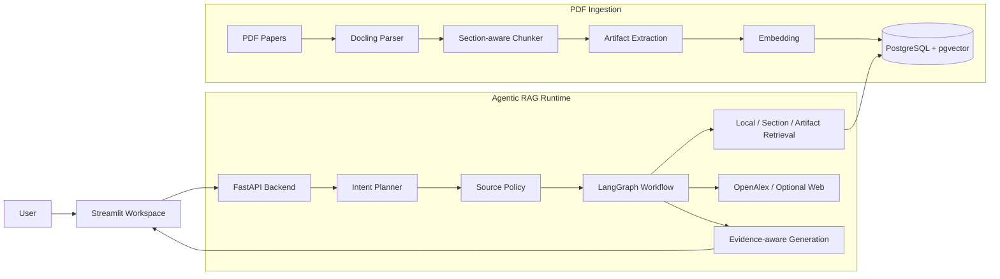
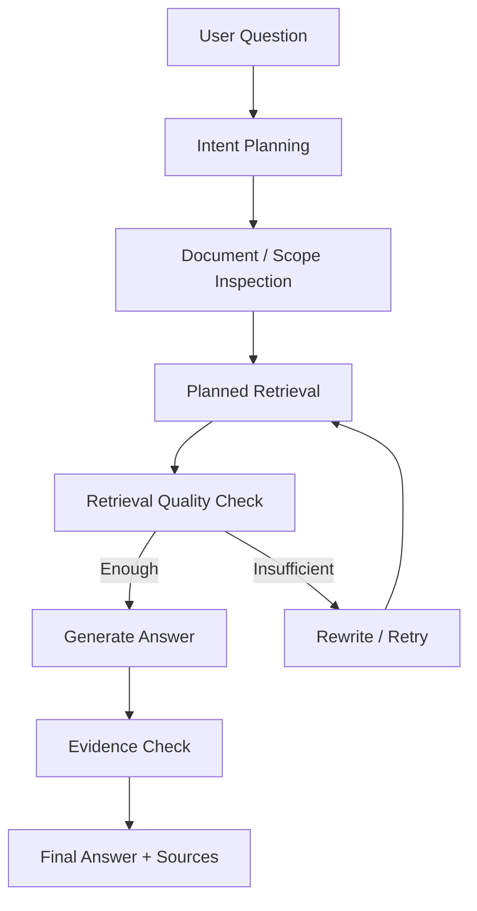

# Design Notes

## 1. 设计目标

Agentic RAG Paper Assistant 面向复杂科研论文阅读场景。项目目标不是做一个通用聊天机器人，而是让论文 RAG 在三个关键位置更可靠：

1. **Evidence Preparation**：入库时保留论文结构和证据信息；
2. **Source Control**：区分本地论文、外部学术检索、网页资料和模型知识；
3. **Workflow Control**：将规划、检索、重试、生成和证据检查显式化，方便测试与调试。

## 2. 系统架构

## 3. Source Selection Policy

系统将不同来源视为不同类型的 evidence，不会把所有结果混在一起处理。

| Source Type | 职责 | 典型工具 |
|---|---|---|
| `local_kb` | 用户上传论文和本地知识库证据 | `hybrid_search`, `vector_search`, `get_document` |
| `local_section` | Abstract、Method、Experiments 等章节限定证据 | `section_search` |
| `local_artifact` | 表格、图、算法和伪代码 | `artifact_search` |
| `external_academic` | 学术元数据和 related work 发现 | `openalex_search` |
| `general_web` | 可选网页信息 | `web_search` |
| `model_knowledge` | 不依赖检索证据的一般解释 | direct answer |

核心约束：

> 本地论文 evidence、OpenAlex 元数据、网页资料和模型通用知识必须保持来源边界，不互相冒充。

这也是项目和普通 RAG Demo 拉开差距的地方之一。

## 4. 为什么需要 Section-aware Chunking

普通固定长度切块在论文场景中有明显问题：

- 容易切断章节边界；
- Method、Experiments、Conclusion 可能混在一起；
- 检索结果难以回到具体章节；
- UI 无法展示可靠的 evidence location。

当前实现基于 Docling 输出的 Markdown-like heading 识别章节，并在 chunk 中保留：

- section title；
- section path；
- section line range；
- section chunk index；
- retrieval title；
- chunk method。

这样可以让检索结果具备更强的可解释性，也方便前端展示“章节、行号、分片、相似度和依据片段”。

## 5. 为什么需要 Artifact-aware Retrieval

论文的重要信息经常藏在非正文结构中：

- 表格包含实验指标；
- 图示描述方法 pipeline；
- 算法块说明真实执行流程；
- 伪代码比文字描述更精确。

因此系统会将 table / figure / algorithm 抽取为独立 artifact chunk，同时保留 caption 和前后文。正文 chunk 中会用占位符指向 artifact chunk，避免表格或图示内容把普通正文 chunk 撑得过长。

## 6. Intent Planner

Planner 不负责最终回答，而是负责轻量规划：

- 当前问题是否需要检索；
- 需要本地论文、章节、artifact、OpenAlex、Web 还是 direct answer；
- 工具是否可用；
- 是否需要披露来源不可用；
- 一轮最多调用几个工具。

设计约束：

- 优先最小必要检索；
- 每轮最多规划 2 个工具；
- 不因为有检索工具就盲目检索；
- 外部工具不可用时不能用本地论文冒充外部结果；
- 普通聊天或常识解释不触发本地知识库检索；
- 混合请求中尽量保留可用部分，并披露不可用来源。

## 7. LangGraph 工作流

深度分析路径由 LangGraph 编排：

这样做的好处：

- 检索失败可以被检测；
- query rewrite / retry 有明确触发点；
- 中间状态可观测；
- 方便写评测和单元测试；
- 回答可以结合 sources、scope policy 和 warnings 生成。

## 8. 会话上下文压缩

多轮论文分析如果直接拼接全部历史，会带来两个问题：

1. 上下文越来越长；
2. planner/tool 的 debug payload 可能污染下一轮 prompt。

因此系统在长会话中使用滚动摘要压缩，重点保留：

- 当前讨论对象；
- 用户约束；
- 章节范围；
- 禁止范围；
- 来源限制；
- 已确认结论；
- 尚未解决的问题。

同时过滤 `intent_plan`、`tools_executed`、`raw_model_content_preview` 等内部调试字段，避免内部 payload 被当作对话内容再次输入模型。

## 9. 流式响应与取消

长论文分析任务可能涉及规划、检索、评估和生成多个阶段。系统通过 SSE 输出流式事件，前端可以展示：

- planning；
- document inspection；
- retrieval；
- generation；
- warning；
- final answer；
- sources。

同时支持取消正在运行的流式生成，避免长任务阻塞用户操作。

## 10. 评测设计

项目评测不是单一排行榜分数，而是围绕工程责任拆分：

| Suite | 目标 | 文档定位 |
|---|---|---|
| Ingestion Integrity | 检查章节、行号、artifact metadata 是否完整 | 稳定指标 |
| Source Policy | 检查来源边界和工具规划 | 稳定指标 |
| Retrieval Contract | 检查检索工具是否满足场景契约 | 诊断指标 |
| Retrieval Loop Diagnostics | 检查重试、改写和 cue 保留 | 诊断指标 |
| Answer Groundedness Audit | 检查未支撑断言和证据差距披露 | 质量门 |

README 只展示稳定指标和整体体系；详细诊断结果保留在 `docs/EVALUATION.md` 和 `evals/results/` 中。

## 11. 当前工程边界

当前版本已经覆盖论文 RAG 的核心链路。后续可以继续优化：

- 页面级 citation mapping；
- 更持久化的入库任务队列；
- 更强的扫描 PDF / 复杂版面处理；
- 更严格的 grounded generation；
- 更丰富的多论文评测 case。

这些属于后续工程增强方向，不影响当前项目作为科研论文 Agentic RAG 工作台的核心展示。
